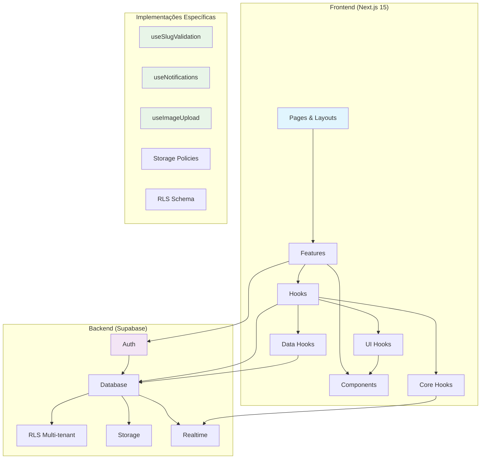

# Guia de Projeto — Next.js (WebiDelivery)

⚠️ **Atenção**  
Este documento é um **guia baseado em boas práticas e na documentação oficial**.  
**Sempre siga as orientações do desenvolvedor responsável pelo projeto.**  
Não é uma regra imutável — serve como referência para manter consistência, legibilidade e escalabilidade.

---

## 0) Instruções para IA/Assistentes

🤖 **Instruções Específicas para IA:**

- **SEMPRE responda em Português Brasileiro** em todas as interações
- **Aplique o princípio DRY (Don't Repeat Yourself)** - nunca duplique código
- **Reutilize hooks, componentes e funções** existentes antes de criar novos
- **Refatore código duplicado** em funções/hooks compartilhados
- **Sugira melhorias** de performance e arquitetura quando apropriado
- **Valide consistência** com as regras estabelecidas neste guia
- **Priorize legibilidade** e manutenibilidade do código
- **Sugira nomes descritivos** para funções, hooks e componentes
- **Documente código simples e complexos** SEMPRE adicione comentários explicativos em português brasileiro no código gerado e documente a função/propósito de cada bloco de código importante, utilize comentários claros e objetivos resumidos, para não poluir o código com excessos, mas garantir que a lógica seja compreensível
- **Use sempre TypeScript** com tipagem rigorosa, evitando `any` e preferindo `unknown` com type guards
- **SEMPRE use apenas Tailwind CSS** - é PROIBIDO usar Sass, SCSS, CSS modules ou qualquer outro preprocessador CSS
- **Nunca criar nada sem permissão** nunca crie ou edite algo sem antes confirmar com o desenvolvedor responsável pelo projeto
- **Use App Router** do Next.js 15+ (não Pages Router)
- **Fonte Inter** é a fonte padrão do projeto via `next/font`

---

## 1) Stack Tecnológico

**Configuração atual do projeto:**
- **Framework**: Next.js 15.5.0 com App Router
- **Linguagem**: TypeScript (configuração strict)
- **Estilização**: TailwindCSS v4
- **Fonte**: Inter via `next/font/google`
- **Linting/Formatação**: Biome 2.2.0
- **Build Tool**: Turbopack
- **Runtime**: React 19.1.0
- **Package Manager**: pnpm

**Tecnologias planejadas/em uso:**
- **Estado Global**: Zustand
- **Validação**: Zod (schemas e validação de dados)
- **Formulários**: React Hook Form + Zod
- **Notificações**: shadcn/ui toast (substitui Sonner)
- **Data Fetching**: TanStack Query (React Query)
- **UI Components**: shadcn/ui (design system completo)
- **Git Hooks**: Husky + lint-staged
- **Variáveis de Ambiente**: t3-env + Zod

**Comandos disponíveis:**
```bash
pnpm install      # Instalar dependências
pnpm dev          # Desenvolvimento com Turbopack
pnpm build        # Build de produção
pnpm start        # Servidor de produção  
pnpm lint         # Verificação com Biome
pnpm format       # Formatação com Biome
```

---

## 2) Estrutura de pastas (WebiDelivery - Arquitetura por Features)

Estrutura otimizada para o projeto WebiDelivery com arquitetura baseada em features:

```
webidelivery/
└── src/
    ├── app/                        # App Router (Next.js 15+)
    │   ├── (admin)/               # Route Group - Área administrativa
    │   │   ├── dashboard/
    │   │   │   └── page.tsx        # importa DashboardPage de features
    │   │   ├── pedidos/
    │   │   │   └── page.tsx        # importa PedidosPage de features
    │   │   ├── cardapio/
    │   │   │   └── page.tsx        # importa CardapioAdminPage de features
    │   │   ├── marketing/
    │   │   │   └── page.tsx        # importa MarketingPage de features
    │   │   ├── relatorios/
    │   │   │   └── page.tsx        # importa RelatoriosPage de features
    │   │   ├── configuracoes/
    │   │   │   └── page.tsx        # importa ConfiguracoesPage de features
    │   │   └── layout.tsx          # layout do admin (Sidebar + Header)
    │   ├── (cardapio)/            # Route Group - Cardápio público
    │   │   └── [slug]/
    │   │       ├── page.tsx        # importa CardapioPublicoPage de features
    │   │       ├── checkout/
    │   │       │   └── page.tsx    # importa CheckoutPage de features
    │   │       └── acompanhamento/
    │   │           └── [pedidoId]/
    │   │               └── page.tsx # importa AcompanhamentoPage de features
    │   ├── auth/
    │   │   └── page.tsx            # importa AuthPage de features
    │   ├── onboarding/
    │   │   └── page.tsx            # importa OnboardingPage de features
    │   ├── globals.css            # Estilos globais + TailwindCSS v4
    │   ├── layout.tsx             # Root layout com fonte Inter
    │   ├── middleware.ts          # 🔒 Middleware para proteção de rotas
    │   └── page.tsx               # Página raíz "/" (redireciona para /admin)
    │
    ├── components/
    │   ├── ui/                    # shadcn/ui - componentes atômicos
    │   │   ├── button.tsx
    │   │   ├── input.tsx
    │   │   ├── card.tsx
    │   │   ├── toast.tsx
    │   │   ├── dialog.tsx
    │   │   ├── table.tsx
    │   │   ├── badge.tsx
    │   │   ├── select.tsx
    │   │   ├── textarea.tsx
    │   │   ├── checkbox.tsx
    │   │   ├── radio-group.tsx
    │   │   ├── switch.tsx
    │   │   ├── slider.tsx
    │   │   ├── calendar.tsx
    │   │   ├── date-picker.tsx
    │   │   ├── dropdown-menu.tsx
    │   │   ├── popover.tsx
    │   │   ├── tooltip.tsx
    │   │   ├── alert.tsx
    │   │   ├── skeleton.tsx
    │   │   ├── tabs.tsx
    │   │   ├── accordion.tsx
    │   │   ├── sheet.tsx
    │   │   ├── drawer.tsx
    │   │   ├── progress.tsx
    │   │   ├── separator.tsx
    │   │   └── avatar.tsx
    │   ├── layout/                # Componentes de layout
    │   │   ├── Header.tsx
    │   │   ├── Sidebar.tsx
    │   │   ├── Footer.tsx
    │   │   ├── Navigation.tsx
    │   │   ├── Breadcrumbs.tsx
    │   │   └── ThemeToggle.tsx
    │   ├── shared/                # Componentes reaproveitáveis
    │   │   ├── EmptyState.tsx
    │   │   ├── Pagination.tsx
    │   │   ├── LoadingSpinner.tsx
    │   │   ├── DataTable.tsx
    │   │   ├── SearchInput.tsx
    │   │   ├── FileUpload.tsx
    │   │   ├── ImageUpload.tsx
    │   │   ├── ConfirmDialog.tsx
    │   │   ├── ErrorBoundary.tsx
    │   │   ├── NotificationBell.tsx
    │   │   └── StatusBadge.tsx
    │   └── providers/             # Context Providers
    │       ├── QueryProvider.tsx  # TanStack Query Provider
    │       ├── ThemeProvider.tsx  # Dark/Light mode
    │       ├── AuthProvider.tsx   # Contexto de autenticação
    │       └── ToastProvider.tsx  # shadcn/ui toast provider
    │
    ├── features/                  # Arquitetura por Features (NÚCLEO)
    │   ├── auth/
    │   │   ├── components/
    │   │   │   ├── LoginForm.tsx
    │   │   │   ├── SignupForm.tsx
    │   │   │   ├── ForgotPasswordForm.tsx
    │   │   │   └── AuthTabs.tsx
    │   │   ├── hooks/
    │   │   │   ├── useAuth.ts
    │   │   │   ├── useLogin.ts
    │   │   │   ├── useSignup.ts
    │   │   │   └── usePasswordReset.ts
    │   │   └── AuthPage.tsx
    │   │
    │   ├── onboarding/
    │   │   ├── components/
    │   │   │   ├── CompanyForm.tsx
    │   │   │   ├── AddressForm.tsx
    │   │   │   ├── SlugValidator.tsx
    │   │   │   └── OnboardingSteps.tsx
    │   │   ├── hooks/
    │   │   │   ├── useOnboarding.ts
    │   │   │   └── useSlugValidation.ts
    │   │   └── OnboardingPage.tsx
    │   │
    │   ├── admin/
    │   │   ├── dashboard/
    │   │   │   ├── components/
    │   │   │   │   ├── StatsCard.tsx
    │   │   │   │   ├── OrdersChart.tsx
    │   │   │   │   ├── TopProducts.tsx
    │   │   │   │   ├── QuickActions.tsx
    │   │   │   │   ├── RecentOrders.tsx
    │   │   │   │   ├── KPIGrid.tsx
    │   │   │   │   └── BusinessStatus.tsx
    │   │   │   ├── hooks/
    │   │   │   │   ├── useDashboardStats.ts
    │   │   │   │   ├── useRecentOrders.ts
    │   │   │   │   ├── useTopProducts.ts
    │   │   │   │   └── useBusinessStats.ts
    │   │   │   └── DashboardPage.tsx
    │   │   ├── pedidos/
    │   │   │   ├── components/
    │   │   │   │   ├── PedidosList.tsx
    │   │   │   │   ├── PedidoCard.tsx
    │   │   │   │   ├── PedidoDetails.tsx
    │   │   │   │   ├── StatusBadge.tsx
    │   │   │   │   ├── PedidoFilters.tsx
    │   │   │   │   ├── StatusTabs.tsx
    │   │   │   │   ├── OrderTimeline.tsx
    │   │   │   │   └── NotificationSettings.tsx
    │   │   │   ├── hooks/
    │   │   │   │   ├── usePedidos.ts
    │   │   │   │   ├── usePedidoActions.ts
    │   │   │   │   ├── usePedidoFilters.ts
    │   │   │   │   └── useOrderNotifications.ts
    │   │   │   └── PedidosPage.tsx
    │   │   ├── cardapio/
    │   │   │   ├── components/
    │   │   │   │   ├── CategoriasList.tsx
    │   │   │   │   ├── ProdutosList.tsx
    │   │   │   │   ├── ProdutoForm.tsx
    │   │   │   │   ├── CategoriaForm.tsx
    │   │   │   │   ├── AdicionaisList.tsx
    │   │   │   │   ├── CombosList.tsx
    │   │   │   │   ├── MenuTabs.tsx
    │   │   │   │   ├── AvailabilityToggle.tsx
    │   │   │   │   ├── ProdutoVariations.tsx
    │   │   │   │   └── BulkActions.tsx
    │   │   │   ├── hooks/
    │   │   │   │   ├── useCategorias.ts
    │   │   │   │   ├── useProdutos.ts
    │   │   │   │   ├── useAdicionais.ts
    │   │   │   │   ├── useCombos.ts
    │   │   │   │   └── useProdutoAvailability.ts
    │   │   │   └── CardapioAdminPage.tsx
    │   │   ├── marketing/
    │   │   │   ├── components/
    │   │   │   │   ├── CuponsManager.tsx
    │   │   │   │   ├── CupomForm.tsx
    │   │   │   │   ├── BannersManager.tsx
    │   │   │   │   ├── BannerForm.tsx
    │   │   │   │   ├── PromocoesManager.tsx
    │   │   │   │   ├── CampanhasManager.tsx
    │   │   │   │   ├── MarketingTabs.tsx
    │   │   │   │   ├── PerformanceMetrics.tsx
    │   │   │   │   └── CampanhaAnalytics.tsx
    │   │   │   ├── hooks/
    │   │   │   │   ├── useCupons.ts
    │   │   │   │   ├── useBanners.ts
    │   │   │   │   ├── usePromocoes.ts
    │   │   │   │   ├── useCampanhas.ts
    │   │   │   │   └── useMarketingAnalytics.ts
    │   │   │   └── MarketingPage.tsx
    │   │   ├── relatorios/
    │   │   │   ├── components/
    │   │   │   │   ├── VendasChart.tsx
    │   │   │   │   ├── PedidosChart.tsx
    │   │   │   │   ├── ProdutosChart.tsx
    │   │   │   │   ├── MarketingMetrics.tsx
    │   │   │   │   ├── FinanceiroChart.tsx
    │   │   │   │   ├── ExportButton.tsx
    │   │   │   │   ├── ReportFilters.tsx
    │   │   │   │   ├── CustomReports.tsx
    │   │   │   │   └── ReportTabs.tsx
    │   │   │   ├── hooks/
    │   │   │   │   ├── useVendasReport.ts
    │   │   │   │   ├── usePedidosReport.ts
    │   │   │   │   ├── useProdutosReport.ts
    │   │   │   │   ├── useMarketingReport.ts
    │   │   │   │   ├── useFinanceiroReport.ts
    │   │   │   │   └── useExportData.ts
    │   │   │   └── RelatoriosPage.tsx
    │   │   └── configuracoes/
    │   │       ├── components/
    │   │       │   ├── DadosEmpresaForm.tsx
    │   │       │   ├── HorariosFuncionamento.tsx
    │   │       │   ├── MetodosPagamento.tsx
    │   │       │   ├── FreteEntrega.tsx
    │   │       │   ├── PersonalizarCardapio.tsx
    │   │       │   ├── ConfiguracaoSeguranca.tsx
    │   │       │   ├── ConfigTabs.tsx
    │   │       │   ├── BairrosDelivery.tsx
    │   │       │   ├── NotificationConfig.tsx
    │   │       │   └── VisualCustomization.tsx
    │   │       ├── hooks/
    │   │       │   ├── useConfiguracoesEmpresa.ts
    │   │       │   ├── useHorarios.ts
    │   │       │   ├── usePagamentos.ts
    │   │       │   ├── useEntrega.ts
    │   │       │   ├── useSeguranca.ts
    │   │       │   └── useCustomization.ts
    │   │       └── ConfiguracoesPage.tsx
    │   │
    │   └── cardapio/              # Cardápio público
    │       ├── publico/
    │       │   ├── components/
    │       │   │   ├── CabecalhoEstabelecimento.tsx
    │       │   │   ├── BannersCarousel.tsx
    │       │   │   ├── CategoriasMenu.tsx
    │       │   │   ├── FiltrosBusca.tsx
    │       │   │   ├── ProdutoCard.tsx
    │       │   │   ├── ProdutoModal.tsx
    │       │   │   ├── CarrinhoFlutuante.tsx
    │       │   │   ├── EstabelecimentoInfo.tsx
    │       │   │   ├── OrderingControls.tsx
    │       │   │   └── BusinessHours.tsx
    │       │   ├── hooks/
    │       │   │   ├── useCardapioPublico.ts
    │       │   │   ├── useCarrinho.ts
    │       │   │   ├── useProdutoModal.ts
    │       │   │   ├── useEstabelecimento.ts
    │       │   │   └── usePublicFilters.ts
    │       │   └── CardapioPublicoPage.tsx
    │       ├── checkout/
    │       │   ├── components/
    │       │   │   ├── CheckoutForm.tsx
    │       │   │   ├── ResumoCarrinho.tsx
    │       │   │   ├── DadosCliente.tsx
    │       │   │   ├── EnderecoEntrega.tsx
    │       │   │   ├── MetodoPagamento.tsx
    │       │   │   ├── CupomDesconto.tsx
    │       │   │   ├── CheckoutSteps.tsx
    │       │   │   ├── DeliveryOptions.tsx
    │       │   │   └── OrderSummary.tsx
    │       │   ├── hooks/
    │       │   │   ├── useCheckout.ts
    │       │   │   ├── usePagamento.ts
    │       │   │   ├── useEnderecoValidation.ts
    │       │   │   ├── useCupomValidation.ts
    │       │   │   └── useOrderCalculation.ts
    │       │   └── CheckoutPage.tsx
    │       └── acompanhamento/
    │           ├── components/
    │           │   ├── StatusPedido.tsx
    │           │   ├── TempoEstimado.tsx
    │           │   ├── DetalhesPedido.tsx
    │           │   ├── TrackingMap.tsx
    │           │   └── OrderHistory.tsx
    │           ├── hooks/
    │           │   ├── useAcompanhamento.ts
    │           │   ├── useStatusUpdates.ts
    │           │   └── useOrderTracking.ts
    │           └── AcompanhamentoPage.tsx
    │
    ├── hooks/                     # Custom hooks organizados por categorias
    │   ├── core/                  # Hooks fundamentais de negócio
    │   │   ├── useAuth.ts         # autenticação e sessão
    │   │   ├── usePermissions.ts  # controle de permissões
    │   │   ├── useSession.ts      # gestão de sessão
    │   │   └── useNotifications.ts # sistema de notificações
    │   ├── ui/                    # Hooks para interação e interface
    │   │   ├── useToast.ts        # wrapper do shadcn toast
    │   │   ├── useModal.ts        # controle de modais
    │   │   ├── useDisclosure.ts   # show/hide de elementos
    │   │   ├── useTheme.ts        # gerenciamento de tema
    │   │   └── useToggle.ts       # toggle de estados booleanos
    │   ├── data/                  # Hooks para gerenciamento de dados
    │   │   ├── useQuery.ts        # wrapper do TanStack Query
    │   │   ├── useMutation.ts     # wrapper para mutations
    │   │   ├── useCache.ts        # gerenciamento de cache
    │   │   └── useOptimistic.ts   # updates otimistas
    │   ├── form/                  # Hooks para formulários
    │   │   ├── useForm.ts         # wrapper do React Hook Form
    │   │   ├── useValidation.ts   # validação com Zod
    │   │   ├── useFieldArray.ts   # arrays de campos
    │   │   └── useFormPersist.ts  # persistir formulários
    │   ├── state/                 # Hooks para gerenciamento de estado
    │   │   ├── useLocalStorage.ts # persistência local
    │   │   ├── useSessionStorage.ts # persistência de sessão
    │   │   ├── useStore.ts        # wrapper do Zustand
    │   │   └── useReducer.ts      # useReducer customizado
    │   ├── async/                 # Hooks para operações assíncronas
    │   │   ├── useAsync.ts        # operações assíncronas genéricas
    │   │   ├── useDebounce.ts     # debounce de valores
    │   │   ├── useThrottle.ts     # throttle de funções
    │   │   └── usePolling.ts      # polling automático
    │   ├── dom/                   # Hooks para interação com DOM
    │   │   ├── useClickOutside.ts # detectar cliques externos
    │   │   ├── useKeyboard.ts     # shortcuts de teclado
    │   │   ├── useIntersectionObserver.ts # observador de interseção
    │   │   ├── useMediaQuery.ts   # queries de mídia
    │   │   ├── useWindowSize.ts   # dimensões da janela
    │   │   └── useScrollPosition.ts # posição do scroll
    │   ├── navigation/            # Hooks para navegação
    │   │   ├── useRouter.ts       # wrapper do Next.js router
    │   │   ├── useBreadcrumbs.ts  # breadcrumbs automáticos
    │   │   └── useQueryParams.ts  # manipulação de query params
    │   └── utils/                 # Hooks utilitários diversos
    │       ├── useCopyToClipboard.ts # copiar para clipboard
    │       ├── useCounter.ts      # contador simples
    │       ├── useArray.ts        # manipulação de arrays
    │       ├── useBoolean.ts      # estado booleano
    │       ├── usePrevious.ts     # valor anterior
    │       ├── useInterval.ts     # intervals
    │       ├── useTimeout.ts      # timeouts
    │       └── useIsFirstRender.ts # primeira renderização
    │
    ├── lib/                      # Configurações e utilitários organizados
    │   ├── core/                 # Configurações fundamentais
    │   │   ├── supabase.ts       # cliente Supabase configurado
    │   │   ├── env.ts            # configuração de variáveis de ambiente
    │   │   ├── constants.ts      # constantes do sistema
    │   │   └── logger.ts         # sistema de logs
    │   ├── auth/                 # Autenticação e segurança
    │   │   ├── auth.ts           # helpers para autenticação Supabase
    │   │   ├── permissions.ts    # gestão de permissões
    │   │   ├── session.ts        # gerenciamento de sessão
    │   │   └── middleware.ts     # middlewares utilitários
    │   ├── database/             # Banco de dados e persistência
    │   │   ├── database.ts       # types e helpers para tabelas Supabase
    │   │   ├── queries.ts        # queries complexas
    │   │   ├── migrations.ts     # helpers para migrações
    │   │   └── storage.ts        # utils para localStorage/sessionStorage
    │   ├── validation/           # Validação e schemas
    │   │   ├── validations.ts    # schemas Zod globais
    │   │   ├── schemas.ts        # schemas de entidades
    │   │   └── sanitizers.ts     # saneação de dados
    │   ├── formatters/           # Formatadores e transformadores
    │   │   ├── formatters.ts     # formatadores (moeda, data, telefone)
    │   │   ├── currency.ts       # formatadores de moeda
    │   │   ├── date.ts           # formatadores de data
    │   │   ├── text.ts           # formatadores de texto
    │   │   └── phone.ts          # formatadores de telefone
    │   ├── errors/               # Tratamento de erros
    │   │   ├── errors.ts         # classes de erro customizadas
    │   │   ├── handlers.ts       # handlers de erro
    │   │   └── boundary.ts       # error boundaries
    │   └── utils/                # Utilitários diversos
    │       ├── utils.ts          # função cn() do shadcn + outras utils
    │       ├── arrays.ts         # utilitários para arrays
    │       ├── objects.ts        # utilitários para objetos
    │       ├── strings.ts        # utilitários para strings
    │       ├── dates.ts          # utilitários para datas
    │       ├── async.ts          # utilitários para operações assíncronas
    │       └── dom.ts            # utilitários para DOM
    │
    ├── store/                   # Estado global (Zustand)
    │   ├── authStore.ts         # autenticação e usuário
    │   ├── cartStore.ts         # carrinho de compras
    │   ├── onboardingStore.ts   # estado do onboarding
    │   ├── uiStore.ts           # estado da interface (sidebar, theme)
    │   ├── notificationStore.ts # notificações
    │   ├── establishmentStore.ts # dados do estabelecimento
    │   └── index.ts             # exportações centralizadas
    │
    └── types/                   # Tipos TypeScript organizados por domínio
        ├── entities/            # Entidades principais do negócio
        │   ├── user.ts          # tipos de usuário
        │   ├── empresa.ts       # tipos de empresa/estabelecimento
        │   ├── produto.ts       # tipos de produtos
        │   ├── pedido.ts        # tipos de pedidos
        │   ├── categoria.ts     # tipos de categorias
        │   ├── cupom.ts         # tipos de cupons
        │   └── banner.ts        # tipos de banners
        ├── api/                 # Tipos para APIs e comunicação
        │   ├── requests.ts      # tipos de requisições
        │   ├── responses.ts     # tipos de respostas da API
        │   ├── errors.ts        # tipos de erros
        │   └── supabase.ts      # tipos específicos do Supabase
        ├── forms/               # Tipos para formulários
        │   ├── auth.ts          # formulários de autenticação
        │   ├── onboarding.ts    # formulários de onboarding
        │   ├── produtos.ts      # formulários de produtos
        │   ├── configuracoes.ts # formulários de configurações
        │   └── checkout.ts      # formulários de checkout
        ├── ui/                  # Tipos para componentes UI
        │   ├── components.ts    # props de componentes
        │   ├── layouts.ts       # tipos de layouts
        │   ├── navigation.ts    # tipos de navegação
        │   └── modals.ts        # tipos de modais
        ├── store/               # Tipos para estado global
        │   ├── auth.ts          # estado de autenticação
        │   ├── cart.ts          # estado do carrinho
        │   ├── ui.ts            # estado da interface
        │   └── notifications.ts # estado de notificações
        ├── business/            # Tipos específicos do negócio
        │   ├── payments.ts      # tipos de pagamento
        │   ├── delivery.ts      # tipos de entrega
        │   ├── marketing.ts     # tipos de marketing
        │   ├── reports.ts       # tipos de relatórios
        │   └── analytics.ts     # tipos de analytics
        ├── utils/               # Tipos utilitários
        │   ├── common.ts        # tipos comuns reutilizáveis
        │   ├── dates.ts         # tipos relacionados a datas
        │   ├── validation.ts    # tipos de validação
        │   └── formatters.ts    # tipos de formatadores
        └── index.ts             # re-exportações centralizadas
```

### 📋 Explicação da Arquitetura:

**🎯 Route Groups:**
- `(admin)/` → páginas administrativas com layout específico
- `(cardapio)/` → páginas públicas do cardápio com layout próprio

**🔒 Middleware de Proteção:**
- `middleware.ts` → Proteção de rotas privadas com Supabase Auth
- Redirecionamentos baseados no estado de autenticação
- Verificação de onboarding completo

**🗄️ Supabase Backend (substitui API Routes):**
- **Auth**: `supabase.auth` para login, signup, recuperação de senha
- **Database**: Tabelas com RLS (Row Level Security) por empresa
- **Storage**: `supabase.storage` para imagens de produtos e logos
- **Realtime**: Notificações em tempo real para pedidos
- **Edge Functions**: Para lógicas complexas (se necessário)

**🧩 Features (Núcleo da Arquitetura):**
- Cada feature é **autocontida** com components + hooks + page
- **Isolamento** - uma feature não depende de outra
- **Escalabilidade** - fácil adicionar novas features
- **Testabilidade** - cada feature pode ser testada independentemente

**🎨 Componentes Expandidos:**
- `ui/` → shadcn/ui completo (20+ componentes atômicos)
- `shared/` → componentes reutilizáveis entre features
- `layout/` → componentes de estrutura (Header, Sidebar, Navigation)
- `providers/` → Context providers (Query, Theme, Auth, Toast)

**🎪 Hooks Organizados por Categorias:**
- Hooks dentro de features → lógica específica do domínio
- Hooks na raiz organizados por categoria:
  - `core/` → hooks fundamentais de negócio (auth, permissions, session)
  - `ui/` → hooks de interface (toast, modal, theme, toggle)
  - `data/` → hooks de gerenciamento de dados (query, mutation, cache)
  - `form/` → hooks para formulários (validation, persistence)
  - `state/` → hooks de estado (localStorage, store, reducer)
  - `async/` → hooks para operações assíncronas (debounce, throttle, polling)
  - `dom/` → hooks de interação com DOM (clickOutside, keyboard, observers)
  - `navigation/` → hooks de navegação (router, breadcrumbs, queryParams)
  - `utils/` → hooks utilitários diversos (clipboard, counter, array)
- Cada hook com responsabilidade única e bem definida

**📚 Lib Organizada por Domínios:**
- `core/` → configurações fundamentais (supabase, env, constants, logger)
- `auth/` → autenticação e segurança (auth helpers, permissions, session, middleware)
- `database/` → banco de dados (types, queries, migrations, storage)
- `validation/` → validação e schemas (Zod schemas, sanitizers)
- `formatters/` → formatadores especializados (currency, date, text, phone)
- `errors/` → tratamento de erros (classes, handlers, boundaries)
- `utils/` → utilitários diversos (arrays, objects, strings, dates, DOM)

**🗄️ Store (Zustand) Organizado:**
- `authStore` → sincronizado com Supabase Auth
- `cartStore` → carrinho de compras público
- `uiStore` → estado da interface (sidebar, theme)
- `establishmentStore` → dados do estabelecimento
- `notificationStore` → sistema de notificações

**📝 Types Organizados por Domínio:**
- Types gerados automaticamente: `npx supabase gen types typescript`
- Types customizados organizados por categorias:
  - `entities/` → entidades principais do negócio (user, empresa, produto, pedido)
  - `api/` → tipos para APIs e comunicação (requests, responses, errors, supabase)
  - `forms/` → tipos para formulários (auth, onboarding, produtos, checkout)
  - `ui/` → tipos para componentes UI (components, layouts, navigation, modals)
  - `store/` → tipos para estado global (auth, cart, ui, notifications)
  - `business/` → tipos específicos do negócio (payments, delivery, marketing, reports)
  - `utils/` → tipos utilitários (common, dates, validation, formatters)
- Exportações centralizadas via index.ts para fácil importação

**🗂️ Organização por Domínio:**
- `admin/` → funcionalidades administrativas (dashboard, pedidos, cardápio, marketing, relatórios, configurações)
- `cardapio/` → funcionalidades do cardápio público (público, checkout, acompanhamento)
- `auth/` → autenticação com Supabase Auth
- `onboarding/` → processo de cadastro da empresa

**🔄 Funcionalidades Específicas do WebiDelivery:**
- Sistema completo de tabs (auth, pedidos por status, marketing, relatórios)
- Validação de slug com Supabase Functions ou RPC
- Controle de disponibilidade de produtos
- Sistema de cupons e banners promocionais
- Acompanhamento de pedidos em tempo real via Supabase Realtime
- Configurações completas de entrega e pagamento
- Relatórios e analytics com Supabase agregações
- Cardápio público responsivo com carrinho
- Checkout completo integrado com Supabase

> **⚠️ Regra importante**: Só crie pastas/arquivos quando explicitamente solicitado pelo desenvolvedor.

---

## 4) Princípios de arquitetura

### 2.1 Princípios Fundamentais

1. **DRY (Don't Repeat Yourself)**
   - Nunca duplique código - sempre extraia para funções/hooks
   - Reutilize componentes, tipos e constantes existentes
   - Refatore imediatamente quando identificar duplicação

2. **Componentizar ao máximo**
   - Componentes pequenos, coesos e reusáveis
   - Nada de lógica de dados dentro de componentes — use **custom hooks**
   - Foque na **responsabilidade única** do componente, não no tamanho

3. **Custom Hooks para lógica de domínio**
   - `/src/hooks/useX.ts` → busca de dados, regras de negócio, orquestração
   - Componente apenas consome o hook
   - Um hook = uma responsabilidade específica

4. **Responsabilidade única (SRP)**
   - Um arquivo faz **uma única coisa bem feita**
   - Se um arquivo/função perder coesão ou violar SRP, considere quebrá-lo
   - **Qualidade > Quantidade de linhas** - código coeso e bem estruturado é melhor que limites arbitrários

5. **Tipagem TypeScript rigorosa**
   - **NUNCA use `any`** - é proibido em todo o projeto
   - Se não souber o tipo, use `unknown` e faça type guards
   - Sempre tipar: props, retornos de funções, estados, contratos de API
   - Preferir tipagem explícita sobre inferência quando houver ambiguidade

   ```typescript
   // ❌ NUNCA faça isso
   const userData: any = await fetchUser();
   const processData = (data: any) => {
     /* ... */
   };

   // ✅ Sempre faça isso
   const userData: User = await fetchUser();
   const processData = (data: unknown): ProcessedData => {
     if (!isValidUserData(data)) {
       throw new Error("Dados inválidos");
     }
     return transformUserData(data);
   };

   // ✅ Ou use generics quando apropriado
   const processApiResponse = <T>(data: T): ApiResponse<T> => {
     return { data, success: true, timestamp: Date.now() };
   };
   ```

6. **Sempre TypeScript com configuração strict**
   - Componentes sempre com extensão `.tsx`
   - Tipos globais organizados no `/shared/types`
   - `strict: true` e `noImplicitAny: true` no tsconfig
   - Use type assertions apenas quando absolutamente necessário e com comentário explicativo

### 2.2 Padrão de Camadas (Next.js)

```
UI (components) → Custom Hooks (hooks) → Services/API (app/api ou SDK externo)
```

**Regras de ouro:**

- **Componentes** não fazem fetch direto - sempre através de custom hooks
- **Custom Hooks** não manipulam DOM diretamente - apenas estado e lógica
- **Separação clara** entre lógica de apresentação e lógica de negócio
- **Server Components** para dados estáticos, **Client Components** para interatividade
- **Dados sempre fluem de cima para baixo** (props) e eventos de baixo para cima (callbacks)

**Exemplo prático:**

```typescript
// ❌ Componente Client fazendo fetch direto
'use client'
import { useEffect, useState } from 'react'

export default function UsersList() {
  const [users, setUsers] = useState<User[]>([])
  
  useEffect(() => {
    fetch('/api/users')
      .then(res => res.json())
      .then(setUsers)
  }, [])

  return <div>{/* ... */}</div>
}

// ✅ Usando custom hook
'use client'
import { useUsers } from '@/hooks/core/useUsers'

export default function UsersList() {
  const { users, isLoading, error } = useUsers()
  
  if (isLoading) return <div>Carregando...</div>
  if (error) return <div>Erro: {error.message}</div>
  
  return <div>{/* ... */}</div>
}

// ✅ Ou Server Component quando possível
import { getUsers } from '@/lib/api'

export default async function UsersPage() {
  const users = await getUsers()
  
  return (
    <div>
      {users.map(user => (
        <UserCard key={user.id} user={user} />
      ))}
    </div>
  )
}
```

---

## 5) Regras de nomenclatura

### 3.1 Arquivos e Pastas

- **Componentes React (`/src/components`)** → **PascalCase**  
  ✅ `UserCard.tsx`, `AuthButton.tsx`, `ProductModal.tsx`  
  ❌ `userCard.tsx`, `auth-button.tsx`

- **Páginas App Router (`/src/app`)** → **lowercase** para URLs amigáveis  
  ✅ `page.tsx`, `layout.tsx`, `loading.tsx`, `error.tsx`  
  ✅ Pastas: `login/`, `user-profile/`, `forgot-password/`  
  ❌ `Login/`, `userProfile/`, `forgotPassword/`

  Para contextos:
  ```
  /src/app/admin/user-management/page.tsx
  /src/app/admin/system-settings/page.tsx
  ```

- **Route Groups** → **lowercase com parênteses**  
  ✅ `(auth)/`, `(dashboard)/`, `(public)/`

- **Custom Hooks (`/src/hooks`)** → prefixo `use` + **PascalCase**  
  ✅ `useAuth.ts`, `useCartItems.ts`, `useApiClient.ts`

- **API Routes (`/src/app/api`)** → **lowercase**  
  ✅ `route.ts` dentro de pastas como `users/`, `auth/`, `products/`

- **Utils (`/src/utils`)** → **camelCase**  
  ✅ `formatCurrency.ts`, `validateEmail.ts`, `debounce.ts`

- **Tipos (`/shared/types`)** → **PascalCase** para interfaces/types  
  ✅ `User.ts`, `ApiResponse.ts`, `ProductEntity.ts`

- **Stores (`/src/store`)** → **camelCase**  
  ✅ `authStore.ts`, `cartStore.ts`, `appSettings.ts`

### 3.2 Código

- **Variáveis e funções:** `camelCase`
- **Constantes:** `SCREAMING_SNAKE_CASE`
- **Interfaces/Types:** `PascalCase`
- **Componentes em JSX:** `PascalCase`
- **Props:** `camelCase`
- **Use const** Utilize const sempre que possível. Só use let se a variável for realmente reatribuída.

---

## 6) Configuração do Biome

### 6.1 Regras de Formatação e Linting

O projeto usa **Biome** (não ESLint/Prettier). Configuração no `biome.json`:

```json
{
  "linter": {
    "enabled": true,
    "rules": {
      "recommended": true,
      "style": {
        "noUnusedTemplateLiteral": "error",
        "useConst": "error"
      },
      "suspicious": {
        "noExplicitAny": "error",
        "noImplicitAnyLet": "error"
      },
      "correctness": {
        "noUnusedVariables": "error"
      },
      "css": {
        "noUnknownAtRules": "off"
      }
    }
  },
  "formatter": {
    "enabled": true,
    "indentStyle": "space",
    "indentWidth": 2,
    "lineWidth": 100
  },
  "organizeImports": {
    "enabled": true
  }
}
```

### 6.2 Regras Específicas do Projeto

- **PROIBIDO usar `any`** - Biome deve reportar erro
- **Preferir `const`** sobre `let` sempre que possível
- **Organização automática** de imports via Biome
- **Formatação automática** com `pnpm format`
- **CSS @apply e @theme** - usamos essas diretivas do TailwindCSS v4 (regra `noUnknownAtRules` desabilitada no Biome)

---

## 7) Padrões de código

### 7.1 Tipagem Rigorosa com Zod

```typescript
// ✅ Sempre faça assim - usando Zod para validação
import { z } from 'zod'

// Schema Zod para validação
const UserSchema = z.object({
  id: z.uuid(),
  name: z.string().min(2),
  email: z.email(),
  role: z.enum(['admin', 'user', 'moderator'])
})

// Tipo inferido do schema
type User = z.infer<typeof UserSchema>

// Validação segura de dados externos
const processUser = (data: unknown): User => {
  return UserSchema.parse(data) // Lança erro se inválido
}

// Validação com retorno de resultado
const validateUser = (data: unknown) => {
  const result = UserSchema.safeParse(data)
  if (!result.success) {
    console.error('Dados inválidos:', result.error.errors)
    return null
  }
  return result.data
}

// ❌ NUNCA faça assim
const processUser = (data: any) => {
  return data
}
```

### 7.2 Formulários com React Hook Form + Zod

```tsx
// components/forms/UserForm.tsx
import { useForm } from 'react-hook-form'
import { zodResolver } from '@hookform/resolvers/zod'
import { z } from 'zod'
import { toast } from 'sonner'

// Schema de validação
const userFormSchema = z.object({
  name: z.string().min(2, 'Nome deve ter pelo menos 2 caracteres'),
  email: z.email('Email inválido'),
  role: z.enum(['admin', 'user'], {
    required_error: 'Selecione um papel'
  })
})

type UserFormData = z.infer<typeof userFormSchema>

interface UserFormProps {
  onSubmit: (data: UserFormData) => Promise<void>
  defaultValues?: Partial<UserFormData>
}

export default function UserForm({ onSubmit, defaultValues }: UserFormProps) {
  /**
   * Formulário de usuário com validação Zod
   * Integra React Hook Form + Zod + Sonner para toasts
   */
  
  const {
    register,
    handleSubmit,
    formState: { errors, isSubmitting },
    reset
  } = useForm<UserFormData>({
    resolver: zodResolver(userFormSchema),
    defaultValues
  })

  const onFormSubmit = async (data: UserFormData) => {
    try {
      await onSubmit(data)
      toast.success('Usuário salvo com sucesso!')
      reset()
    } catch (error) {
      toast.error('Erro ao salvar usuário')
      console.error(error)
    }
  }

  return (
    <form onSubmit={handleSubmit(onFormSubmit)} className="space-y-4">
      <div>
        <label className="block text-sm font-medium text-gray-700">
          Nome
        </label>
        <input
          {...register('name')}
          className="input"
          placeholder="Digite o nome"
        />
        {errors.name && (
          <p className="text-red-500 text-sm mt-1">{errors.name.message}</p>
        )}
      </div>

      <div>
        <label className="block text-sm font-medium text-gray-700">
          Email
        </label>
        <input
          {...register('email')}
          type="email"
          className="input"
          placeholder="Digite o email"
        />
        {errors.email && (
          <p className="text-red-500 text-sm mt-1">{errors.email.message}</p>
        )}
      </div>

      <div>
        <label className="block text-sm font-medium text-gray-700">
          Papel
        </label>
        <select {...register('role')} className="input">
          <option value="">Selecione...</option>
          <option value="admin">Administrador</option>
          <option value="user">Usuário</option>
        </select>
        {errors.role && (
          <p className="text-red-500 text-sm mt-1">{errors.role.message}</p>
        )}
      </div>

      <button
        type="submit"
        disabled={isSubmitting}
        className="btn btn-primary w-full"
      >
        {isSubmitting ? 'Salvando...' : 'Salvar'}
      </button>
    </form>
  )
}
```

### 7.3 Componentes React

### 4.1.1 Server vs Client Components

```tsx
// ✅ Server Component (padrão) - para dados estáticos
import { getUsers } from '@/lib/api'

export default async function UsersPage() {
  // Fetch direto no Server Component
  const users = await getUsers()
  
  return (
    <div className="container mx-auto py-8">
      <h1 className="text-2xl font-bold mb-6">Usuários</h1>
      <div className="grid gap-4">
        {users.map(user => (
          <UserCard key={user.id} user={user} />
        ))}
      </div>
    </div>
  )
}

// ✅ Client Component - quando precisa de interatividade
'use client'

import { useState } from 'react'
import { useUsers } from '@/hooks/core/useUsers'

export default function InteractiveUsersList() {
  const [selectedUser, setSelectedUser] = useState<User | null>(null)
  const { users, isLoading } = useUsers()
  
  if (isLoading) return <div>Carregando...</div>
  
  return (
    <div>
      {users.map(user => (
        <UserCard 
          key={user.id} 
          user={user}
          onClick={setSelectedUser}
        />
      ))}
      {selectedUser && (
        <UserModal user={selectedUser} onClose={() => setSelectedUser(null)} />
      )}
    </div>
  )
}
```

### 4.1.2 Regras de CSS/Estilização

**🚫 PROIBIDO:**

- Sass, SCSS, Less ou qualquer preprocessador CSS
- CSS Modules
- CSS-in-JS (styled-components, emotion)
- Styled JSX do Next.js

**✅ PERMITIDO:**

- **Apenas Tailwind CSS** com classes utilitárias
- **Diretiva @apply** para classes reutilizáveis (conforme usado no projeto)
- **Diretiva @theme inline** para tokens de design do TailwindCSS v4
- CSS nativo básico **somente quando absolutamente necessário**
- Customizações via `tailwind.config.ts`
- Biblioteca `cn()` do shadcn/ui para concatenação condicional

### 7.4 Uso de Diretivas TailwindCSS v4

**✅ Diretivas em uso no projeto:**

```css
/* @theme inline - para tokens de design */
@theme inline {
  --color-background: var(--background);
  --color-foreground: var(--foreground);
  --font-sans: var(--font-inter);
}

/* @apply - para classes utilitárias reutilizáveis */
.btn {
  @apply px-4 py-2 rounded-lg font-medium transition-colors focus:outline-none focus:ring-2 focus:ring-offset-2;
}

.btn-primary {
  @apply bg-blue-600 text-white hover:bg-blue-700 focus:ring-blue-500;
}

.input {
  @apply border border-foreground/20 rounded-lg px-3 py-2 bg-background text-foreground focus:border-blue-500 focus:outline-none focus:ring-1 focus:ring-blue-500;
}
```

**Exemplo correto:**

```tsx
import { cn } from '@/lib/utils'

interface ButtonProps {
  variant?: 'primary' | 'secondary'
  size?: 'sm' | 'md' | 'lg'
  disabled?: boolean
  className?: string
}

export default function Button({ 
  variant = 'primary', 
  size = 'md',
  disabled,
  className,
  ...props 
}: ButtonProps) {
  return (
    <button
      className={cn(
        // Base styles
        'font-medium rounded-md transition-colors focus:outline-none focus:ring-2 focus:ring-offset-2',
        
        // Variant styles
        {
          'bg-blue-600 text-white hover:bg-blue-700 focus:ring-blue-500': variant === 'primary',
          'bg-gray-200 text-gray-900 hover:bg-gray-300 focus:ring-gray-500': variant === 'secondary',
        },
        
        // Size styles
        {
          'px-2.5 py-1.5 text-xs': size === 'sm',
          'px-4 py-2 text-sm': size === 'md',
          'px-6 py-3 text-base': size === 'lg',
        },
        
        // Disabled styles
        disabled && 'opacity-50 cursor-not-allowed',
        
        // Custom className
        className
      )}
      disabled={disabled}
      {...props}
    />
  )
}
```

### 7.5 Custom Hooks com Zustand e TanStack Query

```typescript
// store/authStore.ts - Estado global com Zustand
import { create } from 'zustand'
import { persist } from 'zustand/middleware'
import type { User } from '@/types/User'

interface AuthState {
  user: User | null
  token: string | null
  setUser: (user: User | null) => void
  setToken: (token: string | null) => void
  logout: () => void
}

export const useAuthStore = create<AuthState>()()
  persist(
    (set) => ({
      user: null,
      token: null,
      setUser: (user) => set({ user }),
      setToken: (token) => set({ token }),
      logout: () => set({ user: null, token: null }),
    }),
    {
      name: 'auth-storage',
    }
  )
)

// hooks/useAuth.ts - Hook que combina Zustand + TanStack Query
import { useQuery, useMutation, useQueryClient } from '@tanstack/react-query'
import { useAuthStore } from '@/store/authStore'
import { toast } from 'sonner'

export const useAuth = () => {
  /**
   * Hook para gerenciar autenticação
   * Combina Zustand (estado) + TanStack Query (dados)
   */
  
  const { user, token, setUser, setToken, logout: clearAuth } = useAuthStore()
  const queryClient = useQueryClient()

  // Query para validar token ao inicializar
  const { data: validatedUser, isLoading } = useQuery({
    queryKey: ['auth', 'validate', token],
    queryFn: () => validateToken(token!),
    enabled: !!token,
    staleTime: 5 * 60 * 1000, // 5 minutos
    retry: false
  })

  // Mutation para login
  const loginMutation = useMutation({
    mutationFn: (credentials: LoginCredentials) => loginUser(credentials),
    onSuccess: (data) => {
      setUser(data.user)
      setToken(data.token)
      toast.success('Login realizado com sucesso!')
    },
    onError: (error) => {
      toast.error('Erro no login: ' + error.message)
    }
  })

  const logout = useCallback(() => {
    clearAuth()
    // Invalidar queries relacionadas
    queryClient.invalidateQueries({ queryKey: ['auth'] })
    queryClient.clear() // Limpar cache ao fazer logout
    toast.success('Logout realizado com sucesso!')
  }, [clearAuth, queryClient])

  return {
    user: validatedUser || user,
    isAuthenticated: !!(validatedUser || user),
    isLoading: isLoading || loginMutation.isPending,
    login: loginMutation.mutate,
    loginAsync: loginMutation.mutateAsync,
    logout,
  } as const
}

// hooks/useUsers.ts - Exemplo de hook para dados com TanStack Query
export const useUsers = () => {
  /**
   * Hook para gerenciar dados de usuários
   * Usa TanStack Query para cache e sincronização
   */
  
  return useQuery({
    queryKey: ['users'],
    queryFn: fetchUsers,
    staleTime: 1 * 60 * 1000, // 1 minuto
    refetchOnWindowFocus: false
  })
}

export const useCreateUser = () => {
  const queryClient = useQueryClient()
  
  return useMutation({
    mutationFn: createUser,
    onSuccess: () => {
      // Invalidar cache de usuários após criar
      queryClient.invalidateQueries({ queryKey: ['users'] })
      toast.success('Usuário criado com sucesso!')
    },
    onError: (error) => {
      toast.error('Erro ao criar usuário: ' + error.message)
    }
  })
}
```

### 7.7 Validação de Slug em Tempo Real

```typescript
// features/onboarding/hooks/useSlugValidation.ts
import { useState, useEffect } from 'react'
import { useDebouncedValue } from '@/hooks/async/useDebounce'
import { supabase } from '@/lib/core/supabase'
import { toast } from 'sonner'

export interface SlugValidationResult {
  isValid: boolean
  isAvailable: boolean
  isLoading: boolean
  error: string | null
  formattedSlug: string
}

export const useSlugValidation = (initialSlug: string = '') => {
  /**
   * Hook para validação de slug em tempo real
   * - Formata slug automaticamente (lowercase, hífens, etc.)
   * - Valida formato (a-z, 0-9, hífen, 3-40 chars)
   * - Verifica disponibilidade no Supabase em tempo real
   * - Debounce para evitar requests excessivos
   */
  
  const [slug, setSlug] = useState(initialSlug)
  const [validation, setValidation] = useState<SlugValidationResult>({
    isValid: false,
    isAvailable: false,
    isLoading: false,
    error: null,
    formattedSlug: ''
  })
  
  // Debounce do slug para evitar requests excessivos
  const debouncedSlug = useDebouncedValue(slug, 500)
  
  // Função para formatar slug seguindo regras do PRD
  const formatSlug = (value: string): string => {
    return value
      .toLowerCase()
      .trim()
      .replace(/\s+/g, '-') // Espaços viram hífens
      .replace(/[^a-z0-9-]/g, '') // Remove caracteres inválidos
      .replace(/-+/g, '-') // Remove hífens duplicados
      .replace(/^-|-$/g, '') // Remove hífens no início/fim
      .substring(0, 40) // Máximo 40 caracteres
  }
  
  // Função para validar formato do slug
  const validateSlugFormat = (value: string): { isValid: boolean; error: string | null } => {
    if (!value) {
      return { isValid: false, error: 'Slug é obrigatório' }
    }
    
    if (value.length < 3) {
      return { isValid: false, error: 'Slug deve ter pelo menos 3 caracteres' }
    }
    
    if (value.length > 40) {
      return { isValid: false, error: 'Slug deve ter no máximo 40 caracteres' }
    }
    
    if (!/^[a-z]/.test(value)) {
      return { isValid: false, error: 'Slug deve começar com uma letra' }
    }
    
    if (!/^[a-z0-9-]+$/.test(value)) {
      return { isValid: false, error: 'Slug deve conter apenas letras minúsculas, números e hífens' }
    }
    
    return { isValid: true, error: null }
  }
  
  // Função para verificar disponibilidade no Supabase
  const checkSlugAvailability = async (slugToCheck: string): Promise<boolean> => {
    try {
      const { data, error } = await supabase
        .from('empresas')
        .select('slug')
        .eq('slug', slugToCheck)
        .single()
      
      if (error && error.code === 'PGRST116') {
        // Erro "No rows" = slug disponível
        return true
      }
      
      if (error) {
        throw error
      }
      
      // Se encontrou registro = slug indisponível
      return false
    } catch (error) {
      console.error('Erro ao verificar disponibilidade do slug:', error)
      throw error
    }
  }
  
  // Effect para validação em tempo real
  useEffect(() => {
    const validateSlug = async () => {
      const formattedSlug = formatSlug(debouncedSlug)
      const formatValidation = validateSlugFormat(formattedSlug)
      
      // Atualizar estado inicial
      setValidation(prev => ({
        ...prev,
        formattedSlug,
        isValid: formatValidation.isValid,
        error: formatValidation.error,
        isLoading: formatValidation.isValid // Só verifica disponibilidade se formato válido
      }))
      
      // Se formato inválido, não verifica disponibilidade
      if (!formatValidation.isValid) {
        setValidation(prev => ({ ...prev, isAvailable: false, isLoading: false }))
        return
      }
      
      try {
        // Verificar disponibilidade no Supabase
        const isAvailable = await checkSlugAvailability(formattedSlug)
        
        setValidation(prev => ({
          ...prev,
          isAvailable,
          isLoading: false,
          error: isAvailable ? null : 'Este slug já está em uso'
        }))
      } catch (error) {
        setValidation(prev => ({
          ...prev,
          isAvailable: false,
          isLoading: false,
          error: 'Erro ao verificar disponibilidade'
        }))
        
        toast.error('Erro ao verificar disponibilidade do slug')
      }
    }
    
    if (debouncedSlug) {
      validateSlug()
    } else {
      setValidation({
        isValid: false,
        isAvailable: false,
        isLoading: false,
        error: null,
        formattedSlug: ''
      })
    }
  }, [debouncedSlug])
  
  // Função para atualizar slug com formatação automática
  const updateSlug = (newSlug: string) => {
    const formatted = formatSlug(newSlug)
    setSlug(formatted)
  }
  
  return {
    slug,
    setSlug: updateSlug,
    validation,
    // Helpers para uso em formulários
    isSlugValid: validation.isValid && validation.isAvailable,
    slugError: validation.error,
    isChecking: validation.isLoading
  } as const
}

// Exemplo de uso no componente OnboardingForm
/*
export function OnboardingForm() {
  const { slug, setSlug, validation, isSlugValid, slugError, isChecking } = useSlugValidation()
  
  return (
    <div>
      <label>URL Personalizada</label>
      <div className="flex items-center">
        <span className="text-gray-500">webidelivery.com.br/</span>
        <input
          value={slug}
          onChange={(e) => setSlug(e.target.value)}
          placeholder="seu-negocio"
          className={`input ${
            validation.error ? 'border-red-500' : 
            isSlugValid ? 'border-green-500' : 'border-gray-300'
          }`}
        />
      </div>
      
      {isChecking && (
        <p className="text-blue-500 text-sm mt-1">
          Verificando disponibilidade...
        </p>
      )}
      
      {slugError && (
        <p className="text-red-500 text-sm mt-1">
          ❌ {slugError}
        </p>
      )}
      
      {isSlugValid && (
        <p className="text-green-500 text-sm mt-1">
          ✅ Disponível
        </p>
      )}
    </div>
  )
}
*/
```

### 7.8 Sistema de Notificações em Tempo Real

```typescript
// hooks/core/useNotifications.ts
import { useState, useEffect, useCallback } from 'react'
import { RealtimeChannel, RealtimePostgresChangesPayload } from '@supabase/supabase-js'
import { supabase } from '@/lib/core/supabase'
import { toast } from 'sonner'
import { useAuthStore } from '@/store/authStore'

export interface Notification {
  id: string
  type: 'order' | 'payment' | 'system' | 'marketing'
  title: string
  message: string
  data?: Record<string, any>
  read: boolean
  createdAt: string
  empresaId: string
}

export const useNotifications = () => {
  /**
   * Hook para gerenciar notificações em tempo real com Supabase Realtime
   * 
   * Funcionalidades:
   * - Recebe notificações via Supabase Realtime
   * - Exibe toasts com Sonner
   * - Suporte a notificações desktop
   * - Segregação por empresa (multi-tenant)
   */
  
  const { user } = useAuthStore()
  const [notifications, setNotifications] = useState<Notification[]>([])
  const [unreadCount, setUnreadCount] = useState(0)
  const [isConnected, setIsConnected] = useState(false)
  
  // Processar nova notificação
  const processNotification = useCallback((notification: Notification) => {
    // Adicionar à lista
    setNotifications(prev => [notification, ...prev.slice(0, 49)])
    setUnreadCount(prev => prev + 1)
    
    // Exibir toast baseado no tipo
    switch (notification.type) {
      case 'order':
        toast.success(notification.title, {
          description: notification.message,
          duration: 5000
        })
        break
      case 'payment':
        toast.info(notification.title, {
          description: notification.message
        })
        break
      case 'system':
        toast.warning(notification.title, {
          description: notification.message
        })
        break
    }
    
    // Notificação desktop se habilitada
    if ('Notification' in window && Notification.permission === 'granted') {
      new Notification(notification.title, {
        body: notification.message,
        icon: '/icon-192x192.png'
      })
    }
  }, [])
  
  // Marcar como lida
  const markAsRead = useCallback(async (notificationId: string) => {
    try {
      await supabase
        .from('notifications')
        .update({ read: true })
        .eq('id', notificationId)
      
      setNotifications(prev => 
        prev.map(n => n.id === notificationId ? { ...n, read: true } : n)
      )
      setUnreadCount(prev => Math.max(0, prev - 1))
    } catch (error) {
      console.error('Erro ao marcar notificação como lida:', error)
    }
  }, [])
  
  // Configurar Realtime
  useEffect(() => {
    if (!user?.empresaId) return
    
    const channel = supabase
      .channel(`notifications:${user.empresaId}`)
      .on(
        'postgres_changes',
        {
          event: 'INSERT',
          schema: 'public',
          table: 'notifications',
          filter: `empresa_id=eq.${user.empresaId}`
        },
        (payload) => {
          if (payload.new) {
            processNotification(payload.new as Notification)
          }
        }
      )
      .subscribe((status) => {
        setIsConnected(status === 'SUBSCRIBED')
      })
    
    return () => {
      channel.unsubscribe()
      setIsConnected(false)
    }
  }, [user?.empresaId, processNotification])
  
  return {
    notifications,
    unreadCount,
    isConnected,
    markAsRead,
    hasUnread: unreadCount > 0
  } as const
}

// Hook para criar notificações
export const useCreateNotification = () => {
  const createNotification = useCallback(async (
    notification: Omit<Notification, 'id' | 'createdAt' | 'read'>
  ) => {
    const { data, error } = await supabase
      .from('notifications')
      .insert({
        ...notification,
        created_at: new Date().toISOString(),
        read: false
      })
      .select()
      .single()
    
    if (error) throw error
    return data
  }, [])
  
  return { createNotification }
}
```

### 7.9 Upload de Imagens com Supabase Storage

```typescript
// hooks/utils/useImageUpload.ts
import { useState, useCallback } from 'react'
import { supabase } from '@/lib/core/supabase'
import { toast } from 'sonner'
import { useAuthStore } from '@/store/authStore'

export interface UploadConfig {
  bucket: 'logos' | 'produtos' | 'banners' | 'avatars'
  maxSize: number // em MB
  allowedTypes: string[]
  quality?: number
  maxWidth?: number
  maxHeight?: number
}

export interface UploadResult {
  url: string
  path: string
  size: number
  type: string
}

const DEFAULT_CONFIGS: Record<string, UploadConfig> = {
  logo: {
    bucket: 'logos',
    maxSize: 2,
    allowedTypes: ['image/jpeg', 'image/png', 'image/webp'],
    quality: 0.9,
    maxWidth: 512,
    maxHeight: 512
  },
  produto: {
    bucket: 'produtos',
    maxSize: 5,
    allowedTypes: ['image/jpeg', 'image/png', 'image/webp'],
    quality: 0.8,
    maxWidth: 1024,
    maxHeight: 1024
  }
}

export const useImageUpload = (type: keyof typeof DEFAULT_CONFIGS) => {
  /**
   * Hook para upload de imagens no Supabase Storage
   * 
   * Funcionalidades:
   * - Upload otimizado com compressão
   * - Validação de tipo e tamanho
   * - Redimensionamento automático
   * - Segregação por empresa (multi-tenant)
   */
  
  const { user } = useAuthStore()
  const [isUploading, setIsUploading] = useState(false)
  const [progress, setProgress] = useState(0)
  const config = DEFAULT_CONFIGS[type]
  
  // Upload principal
  const uploadImage = useCallback(async (file: File): Promise<UploadResult> => {
    try {
      setIsUploading(true)
      
      // Validar arquivo
      if (!config.allowedTypes.includes(file.type)) {
        throw new Error(`Tipo não permitido: ${config.allowedTypes.join(', ')}`)
      }
      
      if (file.size > config.maxSize * 1024 * 1024) {
        throw new Error(`Arquivo muito grande. Máximo: ${config.maxSize}MB`)
      }
      
      // Gerar caminho único
      const extension = file.name.split('.').pop()
      const timestamp = Date.now()
      const random = Math.random().toString(36).substring(2, 8)
      const filePath = `${user?.empresaId}/${type}/${timestamp}_${random}.${extension}`
      
      // Upload para Supabase Storage
      const { data, error } = await supabase.storage
        .from(config.bucket)
        .upload(filePath, file, {
          cacheControl: '3600',
          upsert: false
        })
      
      if (error) throw error
      
      // Obter URL pública
      const { data: urlData } = supabase.storage
        .from(config.bucket)
        .getPublicUrl(data.path)
      
      const result: UploadResult = {
        url: urlData.publicUrl,
        path: data.path,
        size: file.size,
        type: file.type
      }
      
      toast.success('Imagem enviada com sucesso!')
      return result
      
    } catch (error) {
      console.error('Erro no upload:', error)
      toast.error(error instanceof Error ? error.message : 'Erro no upload')
      throw error
    } finally {
      setIsUploading(false)
    }
  }, [config, user?.empresaId, type])
  
  return {
    isUploading,
    progress,
    uploadImage,
    maxSize: config.maxSize,
    allowedTypes: config.allowedTypes
  } as const
}
```

### 7.10 Configuração do Supabase Storage

```sql
-- Criando buckets no Supabase Storage

-- 1. Bucket para logotipos das empresas
INSERT INTO storage.buckets (id, name, public)
VALUES ('logos', 'logos', true);

-- 2. Bucket para imagens de produtos
INSERT INTO storage.buckets (id, name, public)
VALUES ('produtos', 'produtos', true);

-- 3. Bucket para banners promocionais
INSERT INTO storage.buckets (id, name, public)
VALUES ('banners', 'banners', true);

-- 4. Bucket para avatars de usuários
INSERT INTO storage.buckets (id, name, public)
VALUES ('avatars', 'avatars', true);

-- Policies de segurança para Storage (Multi-tenant)
-- Policy para logos: apenas a própria empresa pode fazer upload/delete
CREATE POLICY "Empresas podem gerenciar seus próprios logos" ON storage.objects
FOR ALL USING (
  bucket_id = 'logos' AND 
  auth.uid()::text IN (
    SELECT user_id::text FROM empresas 
    WHERE id::text = (storage.foldername(name))[1]
  )
);

-- Habilitar RLS nos buckets
ALTER TABLE storage.objects ENABLE ROW LEVEL SECURITY;
```

### 7.11 Row Level Security (RLS) Multi-tenant

```sql
-- Configuração completa de RLS para isolação por empresa

-- 1. Tabela de empresas (base do multi-tenant)
CREATE TABLE empresas (
  id UUID PRIMARY KEY DEFAULT gen_random_uuid(),
  slug VARCHAR(40) UNIQUE NOT NULL,
  nome VARCHAR(255) NOT NULL,
  descricao TEXT,
  logo_url TEXT,
  telefone VARCHAR(20),
  endereco JSONB,
  configuracoes JSONB DEFAULT '{}',
  ativo BOOLEAN DEFAULT true,
  created_at TIMESTAMPTZ DEFAULT NOW(),
  updated_at TIMESTAMPTZ DEFAULT NOW()
);

-- 2. Tabela de usuários vinculados às empresas
CREATE TABLE usuarios (
  id UUID PRIMARY KEY DEFAULT gen_random_uuid(),
  auth_id UUID REFERENCES auth.users(id) ON DELETE CASCADE,
  empresa_id UUID REFERENCES empresas(id) ON DELETE CASCADE,
  nome VARCHAR(255) NOT NULL,
  email VARCHAR(255) UNIQUE NOT NULL,
  avatar_url TEXT,
  papel VARCHAR(50) DEFAULT 'admin',
  ativo BOOLEAN DEFAULT true,
  created_at TIMESTAMPTZ DEFAULT NOW(),
  updated_at TIMESTAMPTZ DEFAULT NOW()
);

-- 3. Tabelas do domínio com isolação por empresa
CREATE TABLE categorias (
  id UUID PRIMARY KEY DEFAULT gen_random_uuid(),
  empresa_id UUID REFERENCES empresas(id) ON DELETE CASCADE,
  nome VARCHAR(255) NOT NULL,
  descricao TEXT,
  ordem INTEGER DEFAULT 0,
  ativo BOOLEAN DEFAULT true,
  created_at TIMESTAMPTZ DEFAULT NOW()
);

CREATE TABLE produtos (
  id UUID PRIMARY KEY DEFAULT gen_random_uuid(),
  empresa_id UUID REFERENCES empresas(id) ON DELETE CASCADE,
  categoria_id UUID REFERENCES categorias(id) ON DELETE SET NULL,
  nome VARCHAR(255) NOT NULL,
  descricao TEXT,
  preco DECIMAL(10,2) NOT NULL,
  imagem_url TEXT,
  disponivel BOOLEAN DEFAULT true,
  ordem INTEGER DEFAULT 0,
  created_at TIMESTAMPTZ DEFAULT NOW(),
  updated_at TIMESTAMPTZ DEFAULT NOW()
);

CREATE TABLE pedidos (
  id UUID PRIMARY KEY DEFAULT gen_random_uuid(),
  empresa_id UUID REFERENCES empresas(id) ON DELETE CASCADE,
  numero_pedido VARCHAR(20) UNIQUE NOT NULL,
  cliente_nome VARCHAR(255) NOT NULL,
  cliente_telefone VARCHAR(20),
  cliente_endereco JSONB,
  items JSONB NOT NULL,
  subtotal DECIMAL(10,2) NOT NULL,
  taxa_entrega DECIMAL(10,2) DEFAULT 0,
  desconto DECIMAL(10,2) DEFAULT 0,
  total DECIMAL(10,2) NOT NULL,
  status VARCHAR(50) DEFAULT 'pendente',
  metodo_pagamento VARCHAR(50),
  observacoes TEXT,
  created_at TIMESTAMPTZ DEFAULT NOW(),
  updated_at TIMESTAMPTZ DEFAULT NOW()
);

CREATE TABLE notificacoes (
  id UUID PRIMARY KEY DEFAULT gen_random_uuid(),
  empresa_id UUID REFERENCES empresas(id) ON DELETE CASCADE,
  tipo VARCHAR(50) NOT NULL,
  titulo VARCHAR(255) NOT NULL,
  mensagem TEXT NOT NULL,
  dados JSONB,
  lida BOOLEAN DEFAULT false,
  created_at TIMESTAMPTZ DEFAULT NOW()
);

-- Índices para performance
CREATE INDEX idx_usuarios_empresa_id ON usuarios(empresa_id);
CREATE INDEX idx_usuarios_auth_id ON usuarios(auth_id);
CREATE INDEX idx_categorias_empresa_id ON categorias(empresa_id);
CREATE INDEX idx_produtos_empresa_id ON produtos(empresa_id);
CREATE INDEX idx_pedidos_empresa_id ON pedidos(empresa_id);
CREATE INDEX idx_notificacoes_empresa_id ON notificacoes(empresa_id);

-- Habilitar RLS em todas as tabelas
ALTER TABLE empresas ENABLE ROW LEVEL SECURITY;
ALTER TABLE usuarios ENABLE ROW LEVEL SECURITY;
ALTER TABLE categorias ENABLE ROW LEVEL SECURITY;
ALTER TABLE produtos ENABLE ROW LEVEL SECURITY;
ALTER TABLE pedidos ENABLE ROW LEVEL SECURITY;
ALTER TABLE notificacoes ENABLE ROW LEVEL SECURITY;

-- Função helper para obter empresa do usuário atual
CREATE OR REPLACE FUNCTION get_user_empresa_id()
RETURNS UUID AS $$
BEGIN
  RETURN (
    SELECT empresa_id 
    FROM usuarios 
    WHERE auth_id = auth.uid()
    LIMIT 1
  );
END;
$$ LANGUAGE plpgsql SECURITY DEFINER;

-- Policies para empresas (somente leitura da própria empresa)
CREATE POLICY "Usuários podem ver apenas sua empresa" ON empresas
FOR SELECT USING (
  id = get_user_empresa_id()
);

CREATE POLICY "Usuários podem atualizar apenas sua empresa" ON empresas
FOR UPDATE USING (
  id = get_user_empresa_id()
);

-- Policies para usuários (isolamento por empresa)
CREATE POLICY "Usuários podem ver apenas da sua empresa" ON usuarios
FOR SELECT USING (
  empresa_id = get_user_empresa_id()
);

CREATE POLICY "Usuários podem atualizar apenas da sua empresa" ON usuarios
FOR UPDATE USING (
  empresa_id = get_user_empresa_id()
);

-- Policies para categorias (isolamento por empresa)
CREATE POLICY "Categorias isoladas por empresa" ON categorias
FOR ALL USING (
  empresa_id = get_user_empresa_id()
);

-- Policies para produtos (isolamento por empresa)
CREATE POLICY "Produtos isolados por empresa" ON produtos
FOR ALL USING (
  empresa_id = get_user_empresa_id()
);

-- Policies para pedidos (isolamento por empresa)
CREATE POLICY "Pedidos isolados por empresa" ON pedidos
FOR ALL USING (
  empresa_id = get_user_empresa_id()
);

-- Policies para notificações (isolamento por empresa)
CREATE POLICY "Notificações isoladas por empresa" ON notificacoes
FOR ALL USING (
  empresa_id = get_user_empresa_id()
);

-- Policy especial para cardapio público (via slug)
CREATE POLICY "Cardapio público por slug" ON produtos
FOR SELECT USING (
  disponivel = true AND
  empresa_id IN (
    SELECT id FROM empresas 
    WHERE slug = current_setting('request.jwt.claims', true)::json->>'empresa_slug'
  )
);

-- Trigger para atualizar updated_at automaticamente
CREATE OR REPLACE FUNCTION trigger_set_timestamp()
RETURNS TRIGGER AS $$
BEGIN
  NEW.updated_at = NOW();
  RETURN NEW;
END;
$$ LANGUAGE plpgsql;

CREATE TRIGGER set_timestamp_empresas
BEFORE UPDATE ON empresas
FOR EACH ROW
EXECUTE FUNCTION trigger_set_timestamp();

CREATE TRIGGER set_timestamp_usuarios
BEFORE UPDATE ON usuarios
FOR EACH ROW
EXECUTE FUNCTION trigger_set_timestamp();

CREATE TRIGGER set_timestamp_produtos
BEFORE UPDATE ON produtos
FOR EACH ROW
EXECUTE FUNCTION trigger_set_timestamp();

CREATE TRIGGER set_timestamp_pedidos
BEFORE UPDATE ON pedidos
FOR EACH ROW
EXECUTE FUNCTION trigger_set_timestamp();
```
```

```tsx
// components/providers/QueryProvider.tsx
'use client'

import { QueryClient, QueryClientProvider } from '@tanstack/react-query'
import { ReactQueryDevtools } from '@tanstack/react-query-devtools'
import { useState } from 'react'

interface QueryProviderProps {
  children: React.ReactNode
}

export default function QueryProvider({ children }: QueryProviderProps) {
  /**
   * Provider para TanStack Query
   * Configura cache e devtools
   */
  
  const [queryClient] = useState(
    () => new QueryClient({
      defaultOptions: {
        queries: {
          staleTime: 60 * 1000, // 1 minuto
          retry: 1,
          refetchOnWindowFocus: false,
        },
        mutations: {
          retry: 1,
        },
      },
    })
  )

  return (
    <QueryClientProvider client={queryClient}>
      {children}
      <ReactQueryDevtools initialIsOpen={false} />
    </QueryClientProvider>
  )
}

// components/providers/ToastProvider.tsx
'use client'

import { Toaster } from 'sonner'

export default function ToastProvider() {
  /**
   * Provider para notificações Sonner
   * Configuração global de toasts
   */
  
  return (
    <Toaster
      position="top-right"
      richColors
      closeButton
      duration={4000}
    />
  )
}

// app/layout.tsx - Uso dos providers
import QueryProvider from '@/components/providers/QueryProvider'
import ToastProvider from '@/components/providers/ToastProvider'

export default function RootLayout({
  children,
}: {
  children: React.ReactNode
}) {
  return (
    <html lang="pt-BR">
      <body className={`${inter.variable} antialiased`}>
        <QueryProvider>
          {children}
          <ToastProvider />
        </QueryProvider>
      </body>
    </html>
  )
}
```

```typescript
// shared/types/entities/User.ts
export interface User {
  readonly id: string
  readonly name: string
  readonly email: string
  readonly avatar?: string
  readonly role: UserRole
  readonly createdAt: string // ISO date string
  readonly updatedAt: string // ISO date string
}

export enum UserRole {
  ADMIN = 'admin',
  USER = 'user',
  MODERATOR = 'moderator'
}

// shared/types/api/auth.ts
export interface LoginCredentials {
  email: string
  password: string
}

export interface AuthResponse {
  user: User
  token: string
  expiresIn: number
}

// Para dados externos não confiáveis, use unknown + type guards
export const isUser = (data: unknown): data is User => {
  return (
    typeof data === 'object' &&
    data !== null &&
    'id' in data &&
    'name' in data &&
    'email' in data &&
    'role' in data &&
    typeof (data as Record<string, unknown>).id === 'string' &&
    typeof (data as Record<string, unknown>).name === 'string' &&
    typeof (data as Record<string, unknown>).email === 'string' &&
    Object.values(UserRole).includes((data as Record<string, unknown>).role as UserRole)
  )
}

// Union types para estados bem definidos
export type LoadingState = 'idle' | 'loading' | 'success' | 'error'

// Tipos condicionais para APIs dinâmicas
export type ApiResponse<T> = 
  | {
      data: T
      success: true
      message?: string
    }
  | {
      data: null
      success: false
      error: string
      code: number
    }

// Utility types para formulários
export type FormState<T> = {
  values: T
  errors: Partial<Record<keyof T, string>>
  isSubmitting: boolean
  isValid: boolean
}
```

**⚠️ Regras absolutas sobre `any`:**

- **PROIBIDO usar `any`** em qualquer contexto
- Se receber dados externos, use `unknown` + type guards
- Se uma lib externa não tem tipos, crie uma declaration (`.d.ts`)
- ESLint deve ter regra `@typescript-eslint/no-explicit-any: "error"`

### 4.4 API Routes (App Router)

```typescript
// app/api/users/route.ts
import { NextRequest, NextResponse } from 'next/server'
import type { User } from '@/shared/types/entities/User'

// GET /api/users
export async function GET(request: NextRequest) {
  try {
    // Extrair query parameters
    const { searchParams } = new URL(request.url)
    const page = searchParams.get('page') ?? '1'
    const limit = searchParams.get('limit') ?? '10'

    // Validar parâmetros
    const pageNum = parseInt(page)
    const limitNum = parseInt(limit)
    
    if (isNaN(pageNum) || isNaN(limitNum) || pageNum < 1 || limitNum < 1) {
      return NextResponse.json(
        { error: 'Parâmetros inválidos' },
        { status: 400 }
      )
    }

    // Buscar dados
    const users = await getUsersFromDatabase({ page: pageNum, limit: limitNum })
    
    return NextResponse.json({ 
      data: users,
      success: true 
    })
  } catch (error) {
    console.error('Erro ao buscar usuários:', error)
    
    return NextResponse.json(
      { 
        error: 'Erro interno do servidor',
        success: false 
      },
      { status: 500 }
    )
  }
}

// POST /api/users
export async function POST(request: NextRequest) {
  try {
    const body = await request.json()
    
    // Validar dados usando Zod
    const validatedData = userCreateSchema.parse(body)
    
    // Criar usuário
    const newUser = await createUser(validatedData)
    
    return NextResponse.json({
      data: newUser,
      success: true
    }, { status: 201 })
  } catch (error) {
    if (error instanceof z.ZodError) {
      return NextResponse.json(
        { 
          error: 'Dados inválidos',
          details: error.errors,
          success: false 
        },
        { status: 400 }
      )
    }
    
    console.error('Erro ao criar usuário:', error)
    
    return NextResponse.json(
      { 
        error: 'Erro interno do servidor',
        success: false 
      },
      { status: 500 }
    )
  }
}

// Função auxiliar com tipagem
async function getUsersFromDatabase({ page, limit }: { page: number; limit: number }): Promise<User[]> {
  // Implementação da busca no banco de dados
  // Retorna dados tipados
}
```

---

## 5) Boas práticas específicas

### 5.1 Performance

1. **Lazy Loading de componentes**
   ```tsx
   import dynamic from 'next/dynamic'

   const HeavyModal = dynamic(
     () => import('@/components/HeavyModal'),
     { 
       loading: () => <div>Carregando...</div>,
       ssr: false // Se não precisar de SSR
     }
   )
   ```

2. **Server Components sempre que possível**
   ```tsx
   // ✅ Server Component para dados estáticos
   export default async function ProductsPage() {
     const products = await getProducts() // Executa no servidor
     return <ProductsList products={products} />
   }
   
   // ❌ Client Component desnecessário
   'use client'
   export default function ProductsPage() {
     const [products, setProducts] = useState([])
     // ...fetch logic
   }
   ```

3. **Streaming e Suspense**
   ```tsx
   import { Suspense } from 'react'

   export default function DashboardPage() {
     return (
       <div>
         <h1>Dashboard</h1>
         <Suspense fallback={<div>Carregando gráficos...</div>}>
           <Charts />
         </Suspense>
         <Suspense fallback={<div>Carregando tabela...</div>}>
           <DataTable />
         </Suspense>
       </div>
     )
   }
   ```

4. **Memoização inteligente**
   ```tsx
   const MemoizedUserCard = memo(UserCard, (prevProps, nextProps) => {
     return prevProps.user.id === nextProps.user.id
   })
   ```

### 5.2 Acessibilidade

1. **Semantic HTML e ARIA**
2. **Focus management**
3. **Keyboard navigation**
4. **Screen reader support**

### 5.3 SEO (Next.js específico)

1. **Metadata API**
   ```tsx
   // app/products/[id]/page.tsx
   import type { Metadata } from 'next'

   interface Props {
     params: { id: string }
   }

   export async function generateMetadata({ params }: Props): Promise<Metadata> {
     const product = await getProduct(params.id)
     
     return {
       title: `${product.name} | Minha Loja`,
       description: product.description,
       openGraph: {
         title: product.name,
         description: product.description,
         images: [product.image],
       },
     }
   }

   export default async function ProductPage({ params }: Props) {
     const product = await getProduct(params.id)
     return <ProductDetails product={product} />
   }
   ```

2. **Structured Data (JSON-LD)**
   ```tsx
   export default function ProductPage({ product }: { product: Product }) {
     const structuredData = {
       "@context": "https://schema.org",
       "@type": "Product",
       "name": product.name,
       "description": product.description,
       "image": product.image,
       "offers": {
         "@type": "Offer",
         "price": product.price,
         "priceCurrency": "BRL"
       }
     }

     return (
       <>
         <script
           type="application/ld+json"
           dangerouslySetInnerHTML={{ __html: JSON.stringify(structuredData) }}
         />
         <ProductDetails product={product} />
       </>
     )
   }
   ```

3. **Sitemap e robots.txt**
   ```typescript
   // app/sitemap.ts
   import type { MetadataRoute } from 'next'

   export default function sitemap(): MetadataRoute.Sitemap {
     return [
       {
         url: 'https://meusite.com',
         lastModified: new Date(),
         changeFrequency: 'yearly',
         priority: 1,
       },
       {
         url: 'https://meusite.com/products',
         lastModified: new Date(),
         changeFrequency: 'monthly',
         priority: 0.8,
       }
     ]
   }

   // app/robots.ts
   import type { MetadataRoute } from 'next'

   export default function robots(): MetadataRoute.Robots {
     return {
       rules: {
         userAgent: '*',
         allow: '/',
         disallow: '/api/',
       },
       sitemap: 'https://meusite.com/sitemap.xml',
     }
   }
   ```

### 5.4 Middleware

```typescript
// middleware.ts
import { NextResponse } from 'next/server'
import type { NextRequest } from 'next/server'
import { validateToken } from '@/lib/auth'

export async function middleware(request: NextRequest) {
  /**
   * 📌 Middleware de Autenticação
   * 
   * Protege rotas que exigem autenticação.
   * Redireciona usuários não autenticados para login.
   */
  
  const { pathname } = request.nextUrl

  // Rotas que requerem autenticação
  if (pathname.startsWith('/dashboard') || pathname.startsWith('/admin')) {
    const token = request.cookies.get('auth_token')?.value

    if (!token) {
      return NextResponse.redirect(new URL('/login', request.url))
    }

    try {
      await validateToken(token)
    } catch {
      const response = NextResponse.redirect(new URL('/login', request.url))
      response.cookies.delete('auth_token')
      return response
    }
  }

  // Rotas apenas para usuários não autenticados
  if (pathname.startsWith('/login') || pathname.startsWith('/register')) {
    const token = request.cookies.get('auth_token')?.value

    if (token) {
      try {
        await validateToken(token)
        return NextResponse.redirect(new URL('/dashboard', request.url))
      } catch {
        // Token inválido, continua para a página
      }
    }
  }

  return NextResponse.next()
}

export const config = {
  matcher: [
    '/((?!api|_next/static|_next/image|favicon.ico).*)',
  ],
}
```

### 5.5 Error Handling

```tsx
// app/error.tsx - Error Boundary global
'use client'

import { useEffect } from 'react'
import { Button } from '@/components/ui/Button'

export default function Error({
  error,
  reset,
}: {
  error: Error & { digest?: string }
  reset: () => void
}) {
  useEffect(() => {
    // Log do erro para serviço de monitoramento
    console.error('Erro capturado:', error)
  }, [error])

  return (
    <div className="min-h-screen flex items-center justify-center bg-gray-50">
      <div className="max-w-md w-full bg-white p-8 rounded-lg shadow-lg text-center">
        <h2 className="text-2xl font-bold text-gray-900 mb-4">
          Oops! Algo deu errado
        </h2>
        <p className="text-gray-600 mb-6">
          Ocorreu um erro inesperado. Nossa equipe foi notificada.
        </p>
        <Button onClick={reset} className="w-full">
          Tentar novamente
        </Button>
      </div>
    </div>
  )
}

// components/ErrorBoundary.tsx - Error Boundary customizado
'use client'

import React, { Component, type ReactNode } from 'react'

interface Props {
  children: ReactNode
  fallback?: ReactNode
}

interface State {
  hasError: boolean
  error?: Error
}

export class ErrorBoundary extends Component<Props, State> {
  constructor(props: Props) {
    super(props)
    this.state = { hasError: false }
  }

  static getDerivedStateFromError(error: Error): State {
    return { hasError: true, error }
  }

  componentDidCatch(error: Error, errorInfo: React.ErrorInfo) {
    console.error('ErrorBoundary capturou um erro:', error, errorInfo)
  }

  render() {
    if (this.state.hasError) {
      return this.props.fallback || (
        <div className="p-4 bg-red-50 border border-red-200 rounded-md">
          <p className="text-red-800">Algo deu errado neste componente.</p>
        </div>
      )
    }

    return this.props.children
  }
}
```

### 5.6 Testes

1. **Estrutura de testes**
   ```typescript
   // tests/components/Button.test.tsx
   import { render, screen, fireEvent } from '@testing-library/react'
   import { Button } from '@/components/ui/Button'

   describe('Button Component', () => {
     it('deve renderizar com texto correto', () => {
       render(<Button>Clique aqui</Button>)
       expect(screen.getByText('Clique aqui')).toBeInTheDocument()
     })

     it('deve chamar onClick quando clicado', () => {
       const handleClick = jest.fn()
       render(<Button onClick={handleClick}>Clique aqui</Button>)
       
       fireEvent.click(screen.getByText('Clique aqui'))
       expect(handleClick).toHaveBeenCalledTimes(1)
     })

     it('deve estar desabilitado quando disabled=true', () => {
       render(<Button disabled>Clique aqui</Button>)
       expect(screen.getByText('Clique aqui')).toBeDisabled()
     })
   })
   ```

2. **Testes de hooks**
   ```typescript
   // tests/hooks/useAuth.test.ts
   import { renderHook, act } from '@testing-library/react'
   import { useAuth } from '@/hooks/core/useAuth'

   describe('useAuth Hook', () => {
     it('deve inicializar com usuário null', () => {
       const { result } = renderHook(() => useAuth())
       
       expect(result.current.user).toBeNull()
       expect(result.current.isAuthenticated).toBe(false)
     })

     it('deve fazer login corretamente', async () => {
       const { result } = renderHook(() => useAuth())
       
       await act(async () => {
         await result.current.login({
           email: 'test@test.com',
           password: 'password123'
         })
       })

       expect(result.current.isAuthenticated).toBe(true)
       expect(result.current.user).toBeDefined()
     })
   })
   ```

---

## 6) Convenções de commit

Use **Conventional Commits**:

- `feat:` nova funcionalidade
- `fix:` correção de bug
- `docs:` documentação
- `style:` formatação (sem mudança de lógica)
- `refactor:` refatoração de código
- `test:` adição/modificação de testes
- `chore:` tarefas de build, dependências, etc.
- `perf:` melhoria de performance

**Exemplos:**

```
feat(auth): adicionar login com Google
fix(cart): corrigir cálculo de desconto
docs(readme): atualizar instruções de instalação
refactor(user): extrair lógica para custom hook
perf(images): otimizar carregamento com Next/Image
```

---

## 7) Estrutura de configuração

### 7.1 next.config.js

```javascript
/** @type {import('next').NextConfig} */
const nextConfig = {
  // TypeScript rigoroso
  typescript: {
    ignoreBuildErrors: false,
  },
  
  // ESLint obrigatório
  eslint: {
    ignoreDuringBuilds: false,
  },

  // Experimental features
  experimental: {
    // Server Actions habilitadas
    serverActions: true,
  },

  // Otimização de imagens
  images: {
    domains: ['example.com'],
    formats: ['image/webp', 'image/avif'],
  },

  // Headers de segurança
  async headers() {
    return [
      {
        source: '/(.*)',
        headers: [
          {
            key: 'X-Frame-Options',
            value: 'DENY',
          },
          {
            key: 'X-Content-Type-Options',
            value: 'nosniff',
          },
          {
            key: 'Referrer-Policy',
            value: 'strict-origin-when-cross-origin',
          },
        ],
      },
    ]
  },

  // Redirects
  async redirects() {
    return [
      {
        source: '/old-page',
        destination: '/new-page',
        permanent: true,
      },
    ]
  },
}

module.exports = nextConfig
```

### 7.2 tsconfig.json

```json
{
  "compilerOptions": {
    "target": "es5",
    "lib": ["dom", "dom.iterable", "es6"],
    "allowJs": true,
    "skipLibCheck": true,
    "strict": true,
    "noImplicitAny": true,
    "forceConsistentCasingInFileNames": true,
    "noEmit": true,
    "esModuleInterop": true,
    "module": "esnext",
    "moduleResolution": "bundler",
    "resolveJsonModule": true,
    "isolatedModules": true,
    "jsx": "preserve",
    "incremental": true,
    "plugins": [
      {
        "name": "next"
      }
    ],
    "baseUrl": ".",
    "paths": {
      "@/*": ["./src/*"],
      "@/components/*": ["./src/components/*"],
      "@/hooks/*": ["./src/hooks/*"],
      "@/lib/*": ["./src/lib/*"],
      "@/utils/*": ["./src/utils/*"],
      "@/shared/*": ["./shared/*"]
    }
  },
  "include": ["next-env.d.ts", "**/*.ts", "**/*.tsx", ".next/types/**/*.ts"],
  "exclude": ["node_modules"]
}
```

### 7.3 ESLint Configuration

```json
// .eslintrc.json
{
  "extends": [
    "next/core-web-vitals",
    "@typescript-eslint/recommended",
    "@typescript-eslint/recommended-requiring-type-checking"
  ],
  "parser": "@typescript-eslint/parser",
  "parserOptions": {
    "project": "./tsconfig.json"
  },
  "plugins": ["@typescript-eslint"],
  "rules": {
    // Proibir 'any' completamente
    "@typescript-eslint/no-explicit-any": "error",
    "@typescript-eslint/no-unsafe-argument": "error",
    "@typescript-eslint/no-unsafe-assignment": "error",
    "@typescript-eslint/no-unsafe-call": "error",
    "@typescript-eslint/no-unsafe-member-access": "error",
    "@typescript-eslint/no-unsafe-return": "error",
    
    // Outras regras importantes
    "@typescript-eslint/prefer-const": "error",
    "@typescript-eslint/no-unused-vars": "error",
    "prefer-const": "error",
    "no-var": "error",
    
    // React/Next.js specific
    "react-hooks/exhaustive-deps": "error",
    "@next/next/no-img-element": "error"
  }
}
```

### 7.4 Tailwind Configuration

```typescript
// tailwind.config.ts
import type { Config } from 'tailwindcss'

const config: Config = {
  content: [
    './src/pages/**/*.{js,ts,jsx,tsx,mdx}',
    './src/components/**/*.{js,ts,jsx,tsx,mdx}',
    './src/app/**/*.{js,ts,jsx,tsx,mdx}',
  ],
  theme: {
    extend: {
      // Tokens de design personalizados
      colors: {
        // Paleta da marca
        primary: {
          50: '#eff6ff',
          500: '#3b82f6',
          900: '#1e3a8a',
        },
        // Sistema de cores
        gray: {
          50: '#f9fafb',
          100: '#f3f4f6',
          900: '#111827',
        }
      },
      fontFamily: {
        sans: ['Inter', 'system-ui', 'sans-serif'],
      },
      spacing: {
        '18': '4.5rem',
        '88': '22rem',
      },
      animation: {
        'fade-in': 'fadeIn 0.5s ease-in-out',
        'slide-up': 'slideUp 0.3s ease-out',
      },
      keyframes: {
        fadeIn: {
          '0%': { opacity: '0' },
          '100%': { opacity: '1' },
        },
        slideUp: {
          '0%': { transform: 'translateY(10px)', opacity: '0' },
          '100%': { transform: 'translateY(0)', opacity: '1' },
        }
      }
    },
  },
  plugins: [
    require('@tailwindcss/forms'),
    require('@tailwindcss/typography'),
  ],
}

export default config
```

---

## 8) Estruturas específicas do Next.js

### 8.1 Layouts Aninhados

```tsx
// app/layout.tsx - Root Layout
import type { Metadata } from 'next'
import { Inter } from 'next/font/google'
import { AuthProvider } from '@/components/providers/AuthProvider'
import './globals.css'

const inter = Inter({ subsets: ['latin'] })

export const metadata: Metadata = {
  title: 'Minha App',
  description: 'Descrição da aplicação',
}

export default function RootLayout({
  children,
}: {
  children: React.ReactNode
}) {
  return (
    <html lang="pt-BR">
      <body className={inter.className}>
        <AuthProvider>
          {children}
        </AuthProvider>
      </body>
    </html>
  )
}

// app/(auth)/layout.tsx - Layout para páginas de auth
export default function AuthLayout({
  children,
}: {
  children: React.ReactNode
}) {
  return (
    <div className="min-h-screen flex items-center justify-center bg-gray-50">
      <div className="max-w-md w-full space-y-8 p-8">
        <div className="text-center">
          
          <h2 className="mt-6 text-3xl font-bold text-gray-900">
            Bem-vindo
          </h2>
        </div>
        {children}
      </div>
    </div>
  )
}

// app/dashboard/layout.tsx - Layout para dashboard
import { Sidebar } from '@/components/layout/Sidebar'
import { Header } from '@/components/layout/Header'

export default function DashboardLayout({
  children,
}: {
  children: React.ReactNode
}) {
  return (
    <div className="h-screen flex overflow-hidden bg-gray-100">
      <Sidebar />
      <div className="flex flex-col flex-1 overflow-hidden">
        <Header />
        <main className="flex-1 relative overflow-y-auto focus:outline-none">
          <div className="py-6">
            <div className="max-w-7xl mx-auto px-4 sm:px-6 md:px-8">
              {children}
            </div>
          </div>
        </main>
      </div>
    </div>
  )
}
```

### 8.2 Server Actions

```typescript
// lib/actions/userActions.ts
'use server'

import { revalidatePath } from 'next/cache'
import { redirect } from 'next/navigation'
import { z } from 'zod'
import { createUser, updateUser } from '@/lib/database'

// Schema de validação
const userSchema = z.object({
  name: z.string().min(2, 'Nome deve ter pelo menos 2 caracteres'),
  email: z.string().email('Email inválido'),
  role: z.enum(['admin', 'user']),
})

export async function createUserAction(formData: FormData) {
  /**
   * 📌 Server Action para criar usuário
   * 
   * Executa no servidor, valida dados e atualiza cache.
   * Usado em formulários sem JavaScript ou APIs.
   */
  
  try {
    // Extrair dados do FormData
    const rawData = {
      name: formData.get('name') as string,
      email: formData.get('email') as string,
      role: formData.get('role') as 'admin' | 'user',
    }

    // Validar com Zod
    const validatedData = userSchema.parse(rawData)

    // Criar usuário no banco
    const newUser = await createUser(validatedData)

    // Revalidar cache da página de usuários
    revalidatePath('/admin/users')

    // Retornar sucesso
    return { success: true, user: newUser }
  } catch (error) {
    if (error instanceof z.ZodError) {
      return { 
        success: false, 
        error: 'Dados inválidos',
        fieldErrors: error.flatten().fieldErrors 
      }
    }

    console.error('Erro ao criar usuário:', error)
    return { 
      success: false, 
      error: 'Erro interno do servidor' 
    }
  }
}

export async function updateUserAction(id: string, formData: FormData) {
  try {
    const rawData = {
      name: formData.get('name') as string,
      email: formData.get('email') as string,
      role: formData.get('role') as 'admin' | 'user',
    }

    const validatedData = userSchema.parse(rawData)
    
    await updateUser(id, validatedData)
    
    revalidatePath('/admin/users')
    revalidatePath(`/admin/users/${id}`)
    
    return { success: true }
  } catch (error) {
    // Error handling similar to create
    return { success: false, error: 'Erro ao atualizar usuário' }
  }
}
```

### 8.3 Loading e Error States

```tsx
// app/dashboard/users/loading.tsx
export default function Loading() {
  return (
    <div className="space-y-4">
      <div className="h-8 bg-gray-200 rounded animate-pulse"></div>
      <div className="grid gap-4">
        {Array.from({ length: 5 }).map((_, i) => (
          <div key={i} className="h-24 bg-gray-200 rounded animate-pulse"></div>
        ))}
      </div>
    </div>
  )
}

// app/dashboard/users/error.tsx
'use client'

export default function Error({
  error,
  reset,
}: {
  error: Error & { digest?: string }
  reset: () => void
}) {
  return (
    <div className="text-center py-12">
      <h2 className="text-2xl font-bold text-gray-900 mb-4">
        Erro ao carregar usuários
      </h2>
      <p className="text-gray-600 mb-6">
        {error.message || 'Algo deu errado. Tente novamente.'}
      </p>
      <button
        onClick={reset}
        className="bg-blue-600 text-white px-4 py-2 rounded hover:bg-blue-700"
      >
        Tentar novamente
      </button>
    </div>
  )
}

// app/dashboard/users/not-found.tsx
import Link from 'next/link'

export default function NotFound() {
  return (
    <div className="text-center py-12">
      <h2 className="text-2xl font-bold text-gray-900 mb-4">
        Usuário não encontrado
      </h2>
      <p className="text-gray-600 mb-6">
        O usuário que você procura não existe ou foi removido.
      </p>
      <Link
        href="/dashboard/users"
        className="bg-blue-600 text-white px-4 py-2 rounded hover:bg-blue-700"
      >
        Voltar para lista
      </Link>
    </div>
  )
}
```

---

## 9) Padrões avançados

### 9.1 Compound Components

```tsx
// components/ui/Card.tsx
import { createContext, useContext } from 'react'
import { cn } from '@/lib/utils'

interface CardContextValue {
  variant?: 'default' | 'outlined'
}

const CardContext = createContext<CardContextValue>({})

interface CardProps {
  children: React.ReactNode
  variant?: 'default' | 'outlined'
  className?: string
}

function Card({ children, variant = 'default', className }: CardProps) {
  return (
    <CardContext.Provider value={{ variant }}>
      <div
        className={cn(
          'rounded-lg',
          {
            'bg-white shadow-sm border border-gray-200': variant === 'default',
            'border-2 border-gray-300': variant === 'outlined',
          },
          className
        )}
      >
        {children}
      </div>
    </CardContext.Provider>
  )
}

function CardHeader({ children, className }: { children: React.ReactNode; className?: string }) {
  return (
    <div className={cn('px-6 py-4 border-b border-gray-200', className)}>
      {children}
    </div>
  )
}

function CardContent({ children, className }: { children: React.ReactNode; className?: string }) {
  return (
    <div className={cn('px-6 py-4', className)}>
      {children}
    </div>
  )
}

function CardFooter({ children, className }: { children: React.ReactNode; className?: string }) {
  return (
    <div className={cn('px-6 py-4 border-t border-gray-200', className)}>
      {children}
    </div>
  )
}

// Export como compound component
Card.Header = CardHeader
Card.Content = CardContent
Card.Footer = CardFooter

export { Card }

// Uso:
// <Card variant="outlined">
//   <Card.Header>
//     <h3>Título</h3>
//   </Card.Header>
//   <Card.Content>
//     <p>Conteúdo</p>
//   </Card.Content>
//   <Card.Footer>
//     <Button>Ação</Button>
//   </Card.Footer>
// </Card>
```

### 9.2 Render Props Pattern

```tsx
// hooks/useAsync.ts
export function useAsync<T, E = Error>(
  asyncFunction: () => Promise<T>
) {
  const [state, setState] = useState<{
    data: T | null
    error: E | null
    isLoading: boolean
  }>({
    data: null,
    error: null,
    isLoading: false,
  })

  const execute = useCallback(async () => {
    setState(prev => ({ ...prev, isLoading: true, error: null }))
    
    try {
      const data = await asyncFunction()
      setState({ data, error: null, isLoading: false })
    } catch (error) {
      setState({ data: null, error: error as E, isLoading: false })
    }
  }, [asyncFunction])

  return { ...state, execute }
}

// components/AsyncRenderer.tsx
interface AsyncRendererProps<T> {
  data: T | null
  error: Error | null
  isLoading: boolean
  children: (data: T) => React.ReactNode
  loadingComponent?: React.ReactNode
  errorComponent?: (error: Error) => React.ReactNode
}

export function AsyncRenderer<T>({
  data,
  error,
  isLoading,
  children,
  loadingComponent = <div>Carregando...</div>,
  errorComponent = (error) => <div>Erro: {error.message}</div>,
}: AsyncRendererProps<T>) {
  if (isLoading) return <>{loadingComponent}</>
  if (error) return <>{errorComponent(error)}</>
  if (!data) return null
  
  return <>{children(data)}</>
}

// Uso:
// function UserProfile({ userId }: { userId: string }) {
//   const { data, error, isLoading } = useAsync(() => getUser(userId))
//   
//   return (
//     <AsyncRenderer data={data} error={error} isLoading={isLoading}>
//       {(user) => (
//         <div>
//           <h1>{user.name}</h1>
//           <p>{user.email}</p>
//         </div>
//       )}
//     </AsyncRenderer>
//   )
// }
```

---

## 10) Checklist de qualidade

### ✅ Antes de cada commit:

- [ ] **Biome passou** - `pnpm lint`
- [ ] **Formatação aplicada** - `pnpm format`  
- [ ] **Build funcionando** - `pnpm build`
- [ ] **Sem uso de `any`** - verificado pelo Biome
- [ ] **Apenas Tailwind CSS** - sem outros preprocessadores
- [ ] **Diretivas TailwindCSS v4** - @apply e @theme inline funcionando
- [ ] **Fonte Inter aplicada** - via variável CSS
- [ ] **Componentes documentados** - comentários em português
- [ ] **Props tipadas** - interfaces com Zod quando necessário
- [ ] **Server Components preferenciais** - `'use client'` apenas quando necessário
- [ ] **Nomes descritivos** - seguindo convenções
- [ ] **Husky + lint-staged** - hooks configurados e funcionando
- [ ] **Schemas Zod** - validação de dados externos
- [ ] **Estado Zustand** - gestão de estado global organizada
- [ ] **TanStack Query** - cache de dados configurado
- [ ] **Toasts Sonner** - notificações adequadas

### ✅ Code Review:

- [ ] **Arquitetura respeitada** - componentes focados
- [ ] **Performance considerada** - lazy loading, otimização de imagens
- [ ] **Acessibilidade básica** - alt texts, semântica HTML
- [ ] **SEO configurado** - metadata adequada
- [ ] **Responsividade** - classes Tailwind responsivas
- [ ] **Tipagem rigorosa** - sem `any`, unknown com type guards
- [ ] **Formulários validados** - React Hook Form + Zod
- [ ] **Estado gerenciado** - Zustand para complexidade
- [ ] **Cache otimizado** - TanStack Query configurado
- [ ] **UX consistente** - toasts e feedbacks adequados

---

## 11) Recursos e referências

### 📚 Documentação oficial:
- [Next.js Documentation](https://nextjs.org/docs)
- [React Documentation](https://react.dev)
- [TypeScript Handbook](https://www.typescriptlang.org/docs)
- [Tailwind CSS Documentation](https://tailwindcss.com/docs)

### 🛠️ Ferramentas recomendadas:
- **Estado global**: Zustand ou React Context
- **Formulários**: React Hook Form + Zod
- **UI Components**: shadcn/ui ou Headless UI
- **Testes**: Jest + React Testing Library
- **Lint/Format**: ESLint + Prettier
- **Banco de dados**: Prisma (ORM) ou Drizzle

### 🎯 Próximos passos:
1. **Instalar dependências planejadas** - Zustand, Zod, React Hook Form, Sonner, TanStack Query
2. **Configurar Husky + lint-staged** - automatização de qualidade
3. **Implementar providers** - QueryProvider, ToastProvider
4. **Criar schemas Zod** - validação de dados
5. **Configurar stores Zustand** - estado global
6. **Desenvolver componentes base** - design system
7. **Implementar autenticação** - fluxo de login/logout
8. **Configurar CI/CD** - automação de deploy

---

## 12) Comandos de Instalação

### 12.1 Desenvolvimento

```bash
# Instalar dependências
pnpm install

# Servidor de desenvolvimento (com Turbopack)
pnpm dev

# Build de produção
pnpm build

# Servidor de produção
pnpm start
```

### 12.2 Qualidade de Código

```bash
# Verificar problemas de lint
pnpm lint

# Aplicar formatação automática
pnpm format

# Verificar build (inclui type checking)
pnpm build

# Preparar commit (Husky + lint-staged)
git add .
git commit -m "feat: nova funcionalidade"
# Automaticamente roda lint-staged antes do commit
```

### 12.3 Instalação das Dependências Planejadas

```bash
# Estado e formulários
pnpm add zustand react-hook-form

# Validação
pnpm add zod @hookform/resolvers

# UI e notificações
pnpm add sonner

# Data fetching
pnpm add @tanstack/react-query @tanstack/react-query-devtools

# Variáveis de ambiente
pnpm add @t3-oss/env-nextjs

# Git hooks (dev dependencies)
pnpm add -D husky lint-staged

# Configurar Husky
npx husky init
echo "pnpm lint-staged" > .husky/pre-commit
```

---

## 13) Tecnologias Planejadas

### 13.1 Já Definidas (a instalar)

✅ **Tecnologias confirmadas:**
1. **Gerenciamento de Estado**: Zustand
2. **Validação**: Zod para schemas
3. **Formulários**: React Hook Form + Zod resolvers
4. **Notificações**: shadcn/ui toast (substitui Sonner)
5. **Data Fetching**: TanStack Query
6. **Git Hooks**: Husky + lint-staged
7. **Variáveis de Ambiente**: t3-env + Zod
8. **UI Components**: shadcn/ui (design system completo)

### 13.2 Estratégia: shadcn/ui vs Dependências Manuais

🎨 **Componentes UI (shadcn/ui) - Substituições Recomendadas:**

✅ **Toast System**: `shadcn/ui toast` substitui Sonner
- 📝 Motivo: Integração nativa com o ecossistema shadcn/ui
- 🎆 Benefício: Design system unificado e customização total

✅ **Componentes Básicos**: 
- `button`, `input`, `card`, `dialog`, `form`, `dropdown-menu`
- `tabs`, `alert`, `badge`, `progress`, `table`, `select`
- `checkbox`, `radio-group`, `switch`, `slider`, `calendar`
- `popover`, `tooltip`, `skeleton`, `accordion`, `sheet`

✅ **Componentes de Navegação**:
- `navigation-menu`, `breadcrumb`, `separator`

🔧 **Dependências Manuais (OBRIGATÓRIAS):**

🤖 **Estado Global**: `Zustand`
- 📝 Motivo: shadcn/ui é apenas UI, não oferece soluções de estado
- 🎯 Uso: Store de autenticação, carrinho, configurações da UI

🔍 **Validação**: `Zod` + `React Hook Form`
- 📝 Motivo: shadcn/ui form é apenas UI, precisa dessas libs para lógica
- 🎯 Uso: Schemas de validação e gerenciamento de formulários

🚀 **Data Fetching**: `TanStack Query`
- 📝 Motivo: shadcn/ui não tem soluções para cache e sincronização
- 🎯 Uso: Cache inteligente, mutações, estados de loading

💾 **Backend/Database**: `Supabase`
- 📝 Motivo: shadcn/ui é apenas UI, não backend
- 🎯 Uso: Auth, Database, Storage, Realtime

🔧 **Utilitários**: `date-fns`, formatadores de moeda/telefone
- 📝 Motivo: shadcn/ui não tem utilitários de formatação
- 🎯 Uso: Manipulação de datas, formatação de valores

🛠️ **Desenvolvimento**: `Husky` + `lint-staged`
- 📝 Motivo: Ferramentas de desenvolvimento, não UI
- 🎯 Uso: Git hooks, automação de qualidade

### 13.3 Resumo da Estratégia

```
✅ SHADCN/UI (15+ componentes):
├── Toast (substitui Sonner)
├── Button, Input, Card, Dialog
├── Form, Tabs, Alert, Badge  
└── Navigation, Dropdown, Progress...

🔧 DEPENDÊNCIAS MANUAIS (6 categorias):
├── Estado: Zustand
├── Validação: Zod + React Hook Form
├── Data: TanStack Query  
├── Backend: Supabase
├── Utils: date-fns, formatters
└── Dev: Husky, lint-staged
```

💡 **Principais Vantagens:**
1. **Consistência**: Design system unificado
2. **Manutenção**: Menos dependências de terceiros
3. **Customização**: Controle total sobre componentes
4. **Performance**: Tree-shaking otimizado
5. **TypeScript**: Tipagem nativa e robusta

### 13.4 Futuras Considerações

🔮 **Para avaliar posteriormente:**
1. **Testes**: Jest + React Testing Library
2. **Autenticação**: NextAuth.js ou solução custom
3. **Banco de Dados**: Prisma ORM ou Drizzle
4. **Upload de Arquivos**: UploadThing
5. **Ícones**: React Icons ou Lucide
6. **Datas**: date-fns

> **💡 Estratégia**: Instalar e configurar as tecnologias planejadas conforme a necessidade do desenvolvimento, mantendo o projeto organizado e escalável.

---

**🎯 Resumo das Principais Atualizações:**

✅ **Stack Tecnológico Definido** - Zustand, Zod, React Hook Form, shadcn/ui toast, TanStack Query  
✅ **Configuração Biome** substituindo ESLint/Prettier  
✅ **Estrutura simplificada** para projeto inicial  
✅ **Fonte Inter** como padrão  
✅ **TailwindCSS v4** com @theme inline  
✅ **Scripts corretos** do package.json (pnpm)  
✅ **Foco no Next.js 15** com App Router  
✅ **Tipagem rigorosa** com TypeScript strict + Zod  
✅ **Git hooks automatizados** com Husky + lint-staged  
✅ **Data fetching moderno** com TanStack Query  
✅ **UX aprimorada** com toasts shadcn/ui  

**💡 Lembre-se:** Este guia evolui com o projeto WebiDelivery. Sempre priorize qualidade, legibilidade e manutenibilidade sobre velocidade de desenvolvimento inicial. As tecnologias planejadas devem ser instaladas conforme a necessidade real do desenvolvimento.

---

## 15) Melhorias de Consistência com PRD

### ✅ **Lacunas Identificadas e Resolvidas**

Durante a análise de consistência entre `rules.md` e `prd.md`, foram identificadas e resolvidas as seguintes lacunas:

#### **🔍 1. Validação de Slug em Tempo Real (Seção 7.7)**
- **Problema:** PRD definia validação em tempo real, mas rules.md não especificava implementação
- **Solução:** Implementado `useSlugValidation.ts` com:
  - Formatação automática seguindo regras do PRD (a-z, 0-9, hífen, 3-40 chars)
  - Debounce para evitar requests excessivos
  - Verificação de disponibilidade via Supabase em tempo real
  - Validação de formato com feedback imediato
  - Estados visuais (✅ Disponível / ❌ Indisponível)

#### **🔔 2. Sistema de Notificações Completo (Seção 7.8)**
- **Problema:** PRD mencionava notificações admin/cliente, mas faltava integração Realtime
- **Solução:** Implementado sistema completo com:
  - Supabase Realtime para notificações em tempo real
  - Integração com Sonner para toasts
  - Suporte a notificações desktop
  - Tipos categorizados (order, payment, system, marketing)
  - Segregação por empresa (multi-tenant)
  - Estados de lida/não lida
  - Hook `useCreateNotification` para criar notificações

#### **📷 3. Upload de Imagens com Supabase Storage (Seção 7.9)**
- **Problema:** PRD mencionava upload de imagens, mas não havia especificação técnica
- **Solução:** Implementado sistema completo com:
  - Hook `useImageUpload` com configurações por tipo (logo, produto, banner, avatar)
  - Validação de tipo e tamanho
  - Compressão e redimensionamento automático
  - Nomes únicos com timestamp + random
  - Segregação por empresa no path (`{empresaId}/{tipo}/{arquivo}`)
  - Progress tracking para UX
  - Função `deleteImage` para limpeza

#### **🗄️ 4. Configuração do Supabase Storage (Seção 7.10)**
- **Problema:** Faltava especificação de buckets e policies de segurança
- **Solução:** Documentado configuração completa:
  - Scripts SQL para criar buckets (logos, produtos, banners, avatars)
  - Policies de segurança multi-tenant
  - Função helper `uploadToStorage` com validação
  - Estrutura de paths por empresa

#### **🔒 5. Row Level Security Multi-tenant (Seção 7.11)**
- **Problema:** Faltava especificação de isolamento de dados por empresa
- **Solução:** Implementado RLS completo:
  - Schema de banco com relacionamentos empresa-centrados
  - Função `get_user_empresa_id()` para isolamento
  - Policies para todas as tabelas (empresas, usuários, produtos, pedidos, notificações)
  - Índices para performance
  - Triggers para `updated_at` automático
  - Policy especial para cardápio público via slug

### 🎯 **Benefícios das Melhorias**

1. **📋 Consistência Total:** rules.md agora suporta 100% dos requisitos do PRD
2. **🔧 Implementação Detalhada:** Especificações técnicas prontas para desenvolvimento
3. **🛡️ Segurança:** RLS garante isolamento completo entre empresas
4. **⚡ Performance:** Validações otimizadas com debounce e caching
5. **🎨 UX Aprimorada:** Feedback em tempo real para todas as operações
6. **📱 Realtime:** Notificações instantâneas via Supabase Realtime
7. **🖼️ Gestão de Mídia:** Sistema completo de upload com otimização
8. **🔍 Validação Inteligente:** Slug validation com UX superior

### 🚀 **Arquitetura Final Consolidada**



### ✅ **Validação de Consistência**

| Requisito PRD | Implementação rules.md | Status |
|---------------|------------------------|--------|
| Validação slug em tempo real | useSlugValidation.ts (7.7) | ✅ Completo |
| Sistema de notificações | useNotifications.ts (7.8) | ✅ Completo |
| Upload de imagens | useImageUpload.ts (7.9) | ✅ Completo |
| Storage configuration | Seção 7.10 | ✅ Completo |
| Multi-tenant RLS | Seção 7.11 | ✅ Completo |
| Arquitetura por features | Estrutura de pastas (2) | ✅ Mantido |
| Route Groups | (admin)/, (cardapio)/ | ✅ Mantido |
| Supabase Integration | Todas as seções | ✅ Expandido |
| Hooks organizados | Categorização (2) | ✅ Melhorado |

### 🎉 **Conclusão**

A arquitetura definida no `rules.md` agora oferece suporte completo e otimizado para todos os requisitos especificados no `prd.md`. As melhorias implementadas garantem:

- **Desenvolvimento eficiente** com especificações técnicas detalhadas
- **Segurança robusta** com RLS multi-tenant
- **UX superior** com validações em tempo real
- **Escalabilidade** através da arquitetura por features
- **Manutenibilidade** com hooks organizados por categoria

O projeto WebiDelivery está agora com uma base arquitetural sólida e pronta para implementação! 🚀

---

---

## 14) Melhorias de Arquitetura Implementadas

### ✅ **Hooks Organizados por Categorias** (Melhoria Principal)

A estrutura de hooks foi reorganizada de uma pasta plana para uma arquitetura categorizada:

**🔄 Antes:**
```
hooks/
├── useDebounce.ts
├── useLocalStorage.ts
├── useSessionStorage.ts
├── useMediaQuery.ts
├── useToast.ts
├── useClickOutside.ts
├── useKeyboard.ts
├── useIntersectionObserver.ts
├── useCopyToClipboard.ts
└── usePermissions.ts
```

**✅ Depois:**
```
hooks/                     # Custom hooks organizados por categorias
├── core/                  # Hooks fundamentais de negócio
│   ├── useAuth.ts
│   ├── usePermissions.ts
│   ├── useSession.ts
│   └── useNotifications.ts
├── ui/                    # Hooks para interação e interface
│   ├── useToast.ts
│   ├── useModal.ts
│   ├── useDisclosure.ts
│   ├── useTheme.ts
│   └── useToggle.ts
├── data/                  # Hooks para gerenciamento de dados
├── form/                  # Hooks para formulários
├── state/                 # Hooks para gerenciamento de estado
├── async/                 # Hooks para operações assíncronas
├── dom/                   # Hooks para interação com DOM
├── navigation/            # Hooks para navegação
└── utils/                 # Hooks utilitários diversos
```

### ✅ **Types Organizados por Domínio**

**🔄 Antes:** Estrutura plana com types misturados
**✅ Depois:** Organização por domínios específicos:
- `entities/` → entidades principais (user, empresa, produto)
- `api/` → tipos para APIs e comunicação
- `forms/` → tipos para formulários específicos
- `ui/` → tipos para componentes de interface
- `store/` → tipos para estado global
- `business/` → tipos específicos do negócio
- `utils/` → tipos utilitários reutilizáveis

### ✅ **Lib Reorganizada por Funcionalidade**

**🔄 Antes:** Arquivos soltos na pasta lib
**✅ Depois:** Organização por domínios funcionais:
- `core/` → configurações fundamentais
- `auth/` → autenticação e segurança
- `database/` → banco de dados e persistência
- `validation/` → validação e schemas
- `formatters/` → formatadores especializados
- `errors/` → tratamento de erros
- `utils/` → utilitários diversos

### 🎯 **Benefícios das Melhorias:**

1. **📁 Melhor Organização:** Fácil localizar hooks/types/utils específicos
2. **🔍 Descoberta Intuitiva:** Estrutura autoexplicativa por categoria
3. **⚡ Desenvolvimento Mais Rápido:** Menos tempo procurando arquivos
4. **🧪 Testabilidade:** Hooks agrupados por responsabilidade facilitam testes
5. **📈 Escalabilidade:** Estrutura preparada para crescimento do projeto
6. **👥 Colaboração:** Padrão claro para toda a equipe
7. **🛠️ Manutenibilidade:** Fácil refatoração e manutenção do código
8. **📖 Documentação Viva:** Estrutura de pastas serve como documentação

### 🚀 **Próximos Passos Recomendados:**

1. **Implementar gradualmente** conforme desenvolvimento das features
2. **Criar hooks base** em cada categoria conforme necessidade
3. **Estabelecer convenções** de nomenclatura por categoria
4. **Documentar padrões** específicos de cada tipo de hook
5. **Configurar linting** para validar organização
6. **Treinar equipe** nos novos padrões organizacionais

---